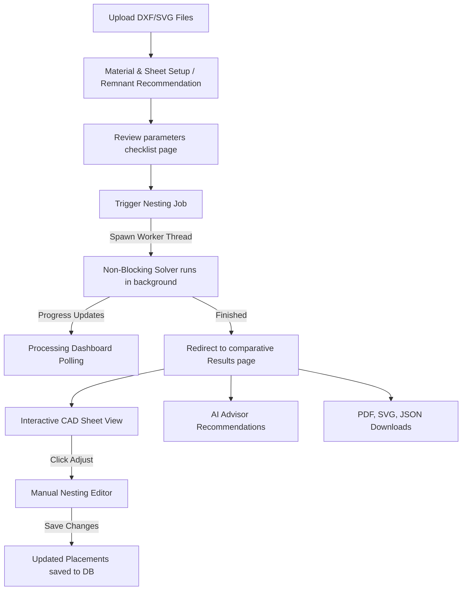
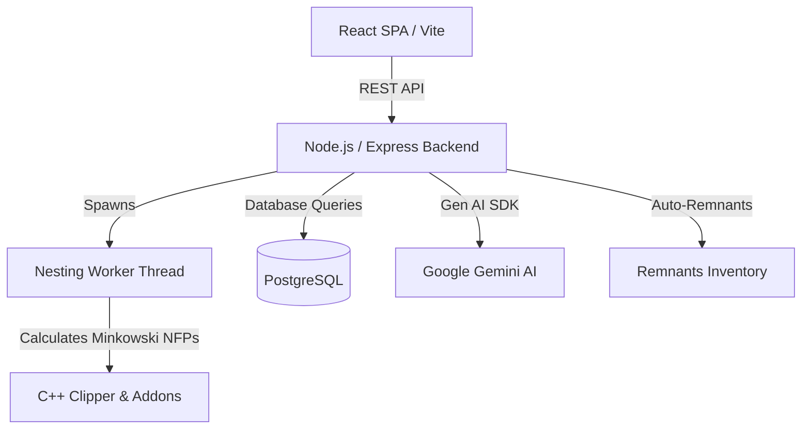

# <p align="center">📐 SmartNest AI — v1.0 Stable</p>

<p align="center">
  <strong>An Industrial-Grade Headless Nesting Optimization Engine, Sheet Remnant Stock Recovery System, and Gemini-Powered Fabrication Advisor.</strong>
</p>

<p align="center">
  
  
  
  
  
  
</p>

---

## 📖 Introduction

SmartNest AI is a modern CAD/CAM nesting dashboard designed to optimize sheet layout yields, minimize scrap waste, calculate real-time fabrication costs, and dynamically recommend remnant reuse. 

With interactive CAD pan-and-zoom previews, geometric centroid calculations, and an embedded Gemini advisor, it bridges the gap between software optimization and physical shop-floor efficiency.

> [!IMPORTANT]
> **Production Status**: **v1.0-Stable** is fully verified. Unit tests, database migrations, and E2E simulation checks have completed successfully.

---

## ✨ System Features

### 📐 1. Headless Genetic Nesting Core
* **Native C++ Engine Integration**: Uses `@deepnest/calculate-nfp` native bindings to run Minkowski Sums directly in Node.js, bypassing heavy Electron GUI requirements.
* **Rotational & Order Mutations**: Packs parts tightly by dynamically mutating sheet order, part sequence, and rotation angles.
* **Optimization Levels**:
  | Tier | Generations | Speed | Intent |
  | :--- | :---: | :---: | :--- |
  | **Greedy** | 0 | Instant | Quick, sequential bounding pass. |
  | **Genetic Fast** | 10 | ~1.5m | Tight packing for basic geometry batches. |
  | **Genetic Balanced** | 50 | ~5m | Maximized packing for complex production runs. |
  | **Genetic Maximum** | 200 | ~20m | Ultimate density pass for heavy cutting templates. |

### ⚡ 2. Asynchronous Worker Thread Offloading (New)
* **Non-Blocking Architecture**: Spawns nesting runs within dedicated Node.js **Worker Threads** (using `worker_threads`).
* **Main Thread Responsiveness**: CPU-heavy genetic packing calculations are offloaded from the Express event loop. Status polling queries, metadata retrieval, and other concurrent API requests resolve instantly (<5ms) without hanging.
* **Natural Lifecycle Management**: Sockets and database references are terminated naturally upon worker completion, eliminating Postgres connection leaks.

### ♻️ 3. Remnant Stock Tracking & Closed-Loop Reuse
* **Auto-Offcut Seed**: Measures sheet coordinates post-run (`Width - maxX`) to record unused rectangular templates.
* **Dynamic Valuation**: Automatically evaluates remnant offcut recovery value using material-specific scrap prices.
* **Remnant Recommendation**: Matches compatible remnants for upcoming projects based on material type, thickness, and nesting area.
* **Loop Closure**: "Use Remnant" toggles dimensions override, locks standard inputs, runs the nesting job strictly on the remnant, and flags it as `used = true`.

### 💰 4. Material Management & Cost Estimation V1
* **Material Master Table**:
  | Material | Density (kg/m³) | Price (₹/kg) | Scrap Rate (₹/kg) |
  | :--- | :---: | :---: | :---: |
  | **Mild Steel** | 7,850 | ₹ 75.00 | ₹ 20.00 |
  | **Stainless Steel 304** | 8,000 | ₹ 200.00 | ₹ 60.00 |
  | **Aluminium** | 2,700 | ₹ 350.00 | ₹ 90.00 |
  | **Copper** | 8,960 | ₹ 1,500.00 | ₹ 400.00 |
  | **Brass** | 8,500 | ₹ 650.00 | ₹ 180.00 |
* **Precise Cost Breakdown**: Outputs total plate volume/weight, raw sheet cost, waste scrap value, and net job cost.

### 🤖 5. Gemini AI Manufacturing Advisor
* Powered by Google Gemini (`gemini-2.5-flash`) via the new `@google/genai` SDK.
* Automatically evaluates nesting runs to output structural JSON summaries, recommendations, and estimated savings.

### 📦 6. Professional Export Center V1
* **Single-Click Industrial Outputs**:
  * **📄 PDF Manufacturing Report**: A premium, print-ready 8-page industrial engineering report containing a centered cover sheet, dynamic layout analyses (advantages, limitations, and metrics tables for Layouts 1, 2, and 3), centered layout visualization drawings, a side-by-side comparative summary table highlighting best-performing metrics, and overall engineering recommendations and conclusions.
  * **🖼 SVG Drawing Layout**: Professional Vector SVG layout containing scaled boundaries, part numbers, and high-fidelity geometries ready for downstream CAD importing.
  * **📦 JSON Coordinates Map**: Complete placement database tracking every part's translation coordinates (`x`, `y`), rotation angles, source file IDs, and optimization metrics.

### 🔄 7. Auto Nest Restoration & Re-Nest Workflow
* **Safe Layout Source Switching**:
  * **Reset to Auto Nest**: Instantly discards manual edit changes and restores the immutable auto-generated placements reference without triggering nesting recalculations.
  * **Re-Generate Nest**: Re-computes a fresh layout from scratch using the original job optimization parameters and updates reference paths.
  * **Visual State Tracking**: Displays active layout type (`AUTO NEST`, `MANUAL EDIT`, or `REGENERATED AUTO NEST`) dynamically.

### ⚡ 8. Multi-Layout Nesting Comparison Mode
* **Three Independent Placement Runs**: Executes the nesting engine three times concurrently using distinct placement objectives:
  * **Layout 1 (Compact Layout)**: Minimizes overall bounding-box area, producing the most compact layout arrangement possible.
  * **Layout 2 (Vertical Packing)**: Packs parts tightly into vertical strips, minimizing horizontal growth. Employs bounding box height as a secondary tie-breaker.
  * **Layout 3 (Horizontal Packing)**: Packs parts tightly into horizontal strips, minimizing vertical growth. Employs bounding box width as a secondary tie-breaker.
* **Layout-Specific Vector Drawings & Metadata**: Each strategy generates its own unique SVG layout file, JSON placements database, and precise metrics (utilization, cutting time, remnant recovery, weight, and runtime).
* **Interactive Multi-Strategy Dashboard**: Switch layout views dynamically with layout selection tabs. Real-time metrics and estimated costs instantly sync to match the selected layout. Displays overall Average Response Time for all runs. Includes a **Layout Statistics Detail Table** in the bottom-right section showing all 13 metrics for the active layout.
* **Export Integration**: Download center automatically packages and serves the layout-specific SVG and JSON files corresponding to the user's active choice.

### 📐 9. Interactive CAD/CAM Manual Nesting Editor
* **Drag-and-Drop Editor Workspace**: Adjust and fine-tune part placements manually by entering **Manual Nest Adjustment** mode.
* **Parts Library Sidebar**: Renders all uploaded geometries with file-extension filtering, search capabilities, and precise unplaced/placed quantity meters.
* **60fps Bounding Box Pre-checks**: Live client-side visual indicators highlight containment:
  * **Green Outline**: Candidate placement is safe and inside the sheet.
  * **Red Outline**: Candidate placement is invalid (overlapping existing parts or sheet borders).
* **Authoritative Collision Engine**: Leverages backend C++ Clipper routines to authorize final part drops, ensuring precision.
* **Granular Controls & Keyboard Shortcuts**:
  * **Scroll Wheel / Mouse Wheel**: Rotate candidate parts in 15° steps before placing.
  * **`R` Key**: Rotate candidate parts by 90°.
  * **`Escape` / Right-Click (Context Menu)**: Cancel placement preview mode.
  * **`Delete` / `Backspace` / Trash Button**: Instantly delete the selected part from the active sheet layout.
* **Layout State Undo/Redo & Save**:
  * Step backward or forward through placement actions.
  * Live status indicator chips (`● Unsaved Changes` vs `✓ Saved`) track dirty status states dynamically.

---

## 🔄 Current Nesting Workflow



1. **Upload Geometry Files:** Upload DXF parts library to a project.
2. **Setup Sheet & Material:** Define material thickness and type, and pick a standard plate size or select a remnant recommended from inventory.
3. **Review Setup Parameters:** Confirm geometry counts and sizes on the review checklist.
4. **Trigger Background Nesting:** The Express route spawns a non-blocking Worker Thread to run calculations.
5. **Monitor Polling Progress:** The Processing dashboard retrieves live, steady updates every 1.5 seconds.
6. **Compare and Adjust Layouts:** Review layouts on the results page, make manual drag-and-drop tweaks if desired, and export industrial PDF reports or SVG layouts.

---

## 📂 Project Architecture

```
smartnest-ai/
├── .agents/                  # Workspace customized behavior rules
├── backend/                  # Node.js + Express API Server
│   ├── src/
│   │   ├── config/           # Database configurations, schema & migrations
│   │   ├── controllers/      # Route handler controllers (Nesting, Remnants, Projects, AI)
│   │   ├── routes/           # REST Endpoint routes
│   │   ├── services/         # Core business logic (Nesting, Costing, AI Advisor)
│   │   └── workers/          # Async Worker Thread handlers (Nesting worker)
│   ├── verify_remnant_reuse.js
│   └── verify_ai_advisor.js
├── frontend/                 # React SPA (Vite + MUI)
│   ├── src/
│   │   ├── components/       # Visual CAD, toolbar and statistics components
│   │   ├── layouts/          # Dashboard Navigation Shells
│   │   ├── pages/            # View pages (Projects, Details, Processing, Results, Remnants)
│   │   └── services/         # Axios API Client Wrapper
└── README.md
```



---

## 🌐 API Endpoints Reference

### 1. Projects
* `GET /api/projects` - List all projects.
* `GET /api/projects/:id` - Fetch details for a specific project.
* `POST /api/projects` - Create a new project.
* `DELETE /api/projects/:id` - Delete project.

### 2. Files
* `GET /api/files/project/:projectId` - Get files uploaded for a project.
* `POST /api/files/upload` - Upload file (DXF/SVG) and set quantity.
* `PUT /api/files/:id/quantity` - Update quantity of a part.
* `DELETE /api/files/:id` - Delete uploaded part.

### 3. Nesting Jobs
* `POST /api/nesting/start/:projectId` - Initialize background nesting run.
* `GET /api/nesting/status/:jobId` - Check polling status and pipeline progress metrics.
* `GET /api/nesting/result/:jobId` - Retrieve completed nesting layout parameters, comparative coordinates, and statistics.
* `GET /api/nesting/layout/:jobId` - Get current placements for manual adjustments.
* `PUT /api/nesting/layout/:jobId` - Save custom layout placements.
* `POST /api/nesting/reset/:jobId` - Discard manual edits and reset layout back to Auto Nest.
* `POST /api/nesting/regenerate/:jobId` - Re-run the genetic solver.

### 4. Remnants
* `GET /api/remnants` - Fetch remnant inventory.
* `GET /api/remnants/recommend/:projectId` - Recommend best-fit remnants for a project.

---

## 🛠️ Step-by-Step Installation

### 1. Database Setup
Create a PostgreSQL database named `smartnest_ai` and run the schema queries inside [schema.sql](file:///e:/smartnest-ai/backend/src/config/schema.sql):
```sql
CREATE DATABASE smartnest_ai;
```

### 2. Configure Environment Secrets
Create a `.env` file inside the `backend` folder:
```ini
PORT=5000
DB_HOST=localhost
DB_PORT=5432
DB_NAME=smartnest_ai
DB_USER=postgres
DB_PASSWORD=your_postgres_password
GEMINI_API_KEY=your_gemini_api_key
```

### 3. Spin Up Services
```bash
# Set up backend server and database
cd backend
npm install
node src/config/migrate.js
npm run dev

# In a separate terminal shell, set up frontend client
cd ../frontend
npm install
npm run dev
```

---

## ⚠️ Known Limitations
1. **Single-Node Core Execution:** Spawning multiple concurrent worker threads runs them in parallel, but heavy optimization jobs under high traffic could overload CPU resources if not managed by a processing queue.
2. **Flat 2D Boundaries:** Geometry processing is restricted to 2D profiles; 3D designs (STEP/IGES) are not supported.

---

## 🚀 Planned Future Enhancements
* **Multi-Sheet Nesting:** Optimize layout packing across multiple sequential plates.
* **Advanced Offcut Outlines:** Store exact, complex polygonal remnant shapes in database rather than simple rectangular bounds.
* **Server-Side Queue Manager:** Add queue-based throttling for running worker jobs.
