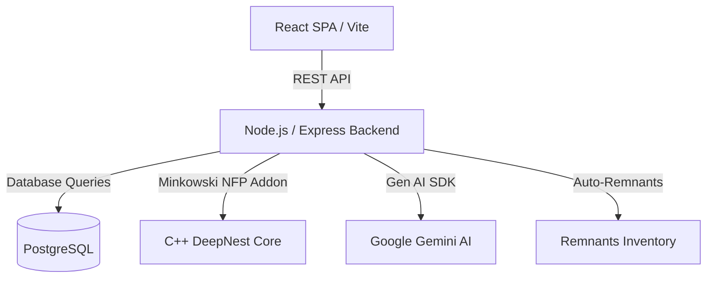

# 📐 SmartNest AI — v1.0 Stable

> **Headless Genetic Nesting Engine, Material Remnant Inventory System, Cost Estimation, and Gemini-Powered AI Manufacturing Advisor.**

SmartNest AI is a modern, high-performance CAD/CAM layout optimization and material planning platform designed to maximize raw sheet utilization, reduce manufacturing scrap, and provide intelligent fabrication recommendations.

---

## ⚡ Core Features

*   **📐 DXF Geometry Upload & Parsing**
    *   Client-side CAD drawing (.dxf) parsing and conversion to vector SVG contours.
    *   Dynamic bounding-box and geometric centroid calculation.
*   **🧬 Genetic Nesting Optimization Engine**
    *   Headless optimization utilizing native C++ No-Fit-Polygon (NFP) and Minkowski Sum calculations.
    *   Generative sequence mutation (swaps, rotation angles, packing order) to maximize sheet yields.
    *   Configurable optimization tiers: Greedy, Fast (10 gens), Balanced (50 gens), and Maximum (200 gens).
*   **🔢 Quantity & Batch Management**
    *   Replicates parts geometrically before processing to optimize individual copies independently.
*   **🪵 Material & Cost Estimation**
    *   Master library rate parameters for Mild Steel, Stainless Steel 304, Aluminium, Copper, and Brass.
    *   Weight estimation using sheet dimensions, thickness, and volumetric density.
    *   Automatic costing metrics: Raw Material Cost, Scrap/Waste Value, and Net Job Cost.
*   **♻️ Remnant Tracking & Reuse (Stock Recovery)**
    *   Automatically calculates leftover rectangular offcuts on run completions and logs them into a global stock dashboard.
    *   Recommends compatible remnants for upcoming projects based on material type, thickness, and footprint.
    *   "Use Remnant" workflow: overrides sheet sizes, runs nesting strictly on the remnant offcut shape, and flags the source remnant as consumed.
*   **🤖 AI Manufacturing Advisor (Gemini integration)**
    *   Integration with Google Gemini (`gemini-2.5-flash`) via the `@google/genai` SDK.
    *   Generates custom recommendations based on actual job metrics: packing density, scrap recovery, layout parameters, and estimated financial savings.

---

## 🏗️ Architecture & Technology Stack



*   **Frontend**: React (Vite), Material UI (MUI), Axios, React Router.
*   **Backend**: Node.js, Express, PostgreSQL (`pg` pool).
*   **AI Service**: Gemini Developer API (`@google/genai` SDK).
*   **Nesting Core**: Headless JavaScript wrapper for native Minkowski C++ bindings (`@deepnest/calculate-nfp`).

---

## ⚙️ Quick Start & Setup

### Prerequisites
*   Node.js (v18+)
*   PostgreSQL
*   Google Gemini API Key

### 1. Database Setup
Create a PostgreSQL database named `smartnest_ai` and run the schema queries inside [schema.sql](file:///e:/smartnest-ai/backend/src/config/schema.sql) to provision tables and indexes.

### 2. Backend Config
Navigate to the `backend` directory, install packages, create a `.env` file, and populate:
```ini
PORT=5000
DB_HOST=localhost
DB_PORT=5432
DB_NAME=smartnest_ai
DB_USER=postgres
DB_PASSWORD=your_postgres_password
GEMINI_API_KEY=your_gemini_api_key
```

Run database migrations and start the dev server:
```bash
cd backend
npm install
node src/config/migrate.js
npm run dev
```

### 3. Frontend Config
Navigate to the `frontend` directory, install packages, and start the development server:
```bash
cd ../frontend
npm install
npm run dev
```
Open [http://localhost:5173/](http://localhost:5173/) in your web browser.

---

## 🧪 Verification & Rollback Commands

### Production Build Verification
To compile the React SPA for production deployment:
```bash
cd frontend
npm run build
```

### Restore Stable Release Checkpoint
If you need to discard new experiments and rollback the codebase to the verified v1.0 stable release:
```bash
# Checkout the tag in detached HEAD mode
git checkout smartnest-v1-stable

# Or hard reset your current branch to the v1.0 release tag
git reset --hard smartnest-v1-stable
```
