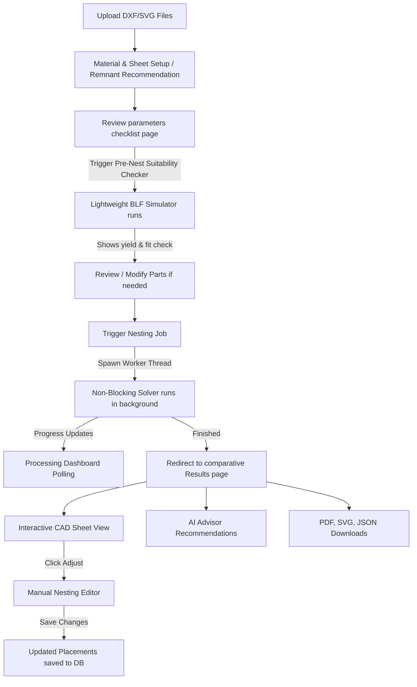

# <p align="center">📐 SmartNest AI — v1.1 Industrial Stable</p>

<p align="center">
  <strong>An Industrial-Grade Headless Nesting Optimization Engine, Sheet Remnant Stock Recovery System, and Gemini-Powered Fabrication Advisor.</strong>
</p>

<p align="center">
  
  
  
  
  
  
</p>

---

## 📖 Introduction

SmartNest AI is a modern CAD/CAM nesting dashboard designed to optimize sheet layout yields, minimize scrap waste, calculate real-time fabrication costs, and dynamically recommend remnant reuse. 

With interactive CAD pan-and-zoom previews, geometric centroid calculations, and an embedded Gemini advisor, it bridges the gap between software optimization and physical shop-floor efficiency.

> [!IMPORTANT]
> **Production Status**: **v1.2-Stable** is fully verified. Recent releases integrate Layout Finalization, custom irregular remnant geometry packing/nesting, authoritative Clipper collision validation, and robust database inventory tracking.

---

## ✨ System Features

### 📐 1. Headless Genetic Nesting Core
* **Native C++ Engine Integration**: Uses `@deepnest/calculate-nfp` native bindings to run Minkowski Sums directly in Node.js, bypassing heavy Electron GUI requirements.
* **Rotational & Order Mutations**: Packs parts tightly by dynamically mutating sheet order, part sequence, and rotation angles.
* **Optimization Levels**:
  | Tier | Generations | Speed | Intent |
  | :--- | :---: | :---: | :--- |
  | **Greedy** | 0 | Instant | Quick, sequential bounding pass. |
  | **Genetic Fast** | 10 | ~1.5m | Tight packing for basic geometry batches. |
  | **Genetic Balanced** | 50 | ~5m | Maximized packing for complex production runs. |
  | **Genetic Maximum** | 200 | ~20m | Ultimate density pass for heavy cutting templates. |

### ⚡ 2. Asynchronous Worker Thread Offloading
* **Non-Blocking Architecture**: Spawns nesting runs within dedicated Node.js **Worker Threads** (using `worker_threads`).
* **Main Thread Responsiveness**: CPU-heavy genetic packing calculations are offloaded from the Express event loop. Status polling queries, metadata retrieval, and other concurrent API requests resolve instantly (<5ms) without hanging.
* **Natural Lifecycle Management**: Sockets and database references are terminated naturally upon worker completion, eliminating Postgres connection leaks.

### ♻️ 3. Advanced Remnant Stock Tracking & Closed-Loop Reuse
* **Auto-Partitioning Leftovers**: Measures leftover sheet boundaries and partitions them into usable rectangular stock sheets and remaining reusable scrap pieces.
* **Dynamic Valuation**: Automatically evaluates remnant offcut recovery value using material-specific scrap prices.
* **Remnant Recommendation**: Matches compatible remnants for upcoming projects based on material type, thickness, and nesting area. Remnants in draft/consumed states are excluded from recommendations to maintain stock consistency.
* **Loop Closure**: "Use Remnant" toggles dimensions override, locks standard inputs, runs the nesting job strictly on the remnant, and transitions its status to `Consumed` once finalized.
* **Custom Boundary Geometry Support**: Stores and handles exact, irregular remnant profiles (outer boundaries and inner holes) in the database. Vector layout canvases and downstream operations render these custom boundaries dynamically using CSS `evenodd` path styling.

### 💰 4. Material Management & Cost Estimation
* **Material Master Table**:
  | Material | Density (kg/m³) | Price (₹/kg) | Scrap Rate (₹/kg) |
  | :--- | :---: | :---: | :---: |
  | **Mild Steel** | 7,850 | ₹ 75.00 | ₹ 20.00 |
  | **Stainless Steel 304** | 8,000 | ₹ 200.00 | ₹ 60.00 |
  | **Aluminium** | 2,700 | ₹ 350.00 | ₹ 90.00 |
  | **Copper** | 8,960 | ₹ 1,500.00 | ₹ 400.00 |
  | **Brass** | 8,500 | ₹ 650.00 | ₹ 180.00 |
* **Precise Cost Breakdown**: Outputs total plate volume/weight, raw sheet cost, waste scrap value, and net job cost.

### 🤖 5. Gemini AI Manufacturing Advisor
* Powered by Google Gemini (`gemini-2.5-flash`) via the new `@google/genai` SDK.
* Automatically evaluates nesting runs to output structural JSON summaries, recommendations, and estimated savings.

### 📦 6. Professional Export Center
* **Single-Click Industrial Outputs**:
  * **📄 PDF Manufacturing Report**: A premium, print-ready 8-page industrial engineering report containing a centered cover sheet, dynamic layout analyses (advantages, limitations, and metrics tables for Layouts 1, 2, and 3), centered layout visualization drawings, a side-by-side comparative summary table highlighting best-performing metrics, and overall engineering recommendations and conclusions.
  * **🖼 SVG Drawing Layout**: Professional Vector SVG layout containing scaled boundaries, part numbers, and high-fidelity geometries ready for downstream CAD importing.
  * **📦 JSON Coordinates Map**: Complete placement database tracking every part's translation coordinates (`x`, `y`), rotation angles, source file IDs, and optimization metrics.

### 🔄 7. Auto Nest Restoration & Re-Nest Workflow
* **Safe Layout Source Switching**:
  * **Reset to Auto Nest**: Instantly discards manual edit changes and restores the immutable auto-generated placements reference without triggering nesting recalculations.
  * **Re-Generate Nest**: Re-computes a fresh layout from scratch using the original job optimization parameters and updates reference paths.
  * **Visual State Tracking**: Displays active layout type (`AUTO NEST`, `MANUAL EDIT`, or `REGENERATED AUTO NEST`) dynamically.

### ⚡ 8. Multi-Layout Nesting Comparison Mode
* **Three Independent Placement Runs**: Executes the nesting engine three times concurrently using distinct placement objectives:
  * **Layout 1 (Compact Layout)**: Minimizes overall bounding-box area, producing the most compact layout arrangement possible.
  * **Layout 2 (Vertical Packing)**: Packs parts tightly into vertical strips, minimizing horizontal growth. Employs bounding box height as a secondary tie-breaker.
  * **Layout 3 (Horizontal Packing)**: Packs parts tightly into horizontal strips, minimizing vertical growth. Employs bounding box width as a secondary tie-breaker.
* **Layout-Specific Vector Drawings & Metadata**: Each strategy generates its own unique SVG layout file, JSON placements database, and precise metrics (utilization, cutting time, remnant recovery, weight, and runtime).
* **Interactive Multi-Strategy Dashboard**: Switch layout views dynamically with layout selection tabs. Real-time metrics and estimated costs instantly sync to match the selected layout. Displays overall Average Response Time for all runs. Includes a **Layout Statistics Detail Table** in the bottom-right section showing all 13 metrics for the active layout.
* **Export Integration**: Download center automatically packages and serves the layout-specific SVG and JSON files corresponding to the user's active choice.

### 📐 9. Interactive CAD/CAM Manual Nesting Editor
* **Drag-and-Drop Editor Workspace**: Adjust and fine-tune part placements manually by entering **Manual Nest Adjustment** mode.
* **Parts Library Sidebar**: Renders all uploaded geometries with file-extension filtering, search capabilities, and precise unplaced/placed quantity meters.
* **60fps Bounding Box Pre-checks**: Live client-side visual indicators highlight containment:
  * **Green Outline**: Candidate placement is safe and inside the sheet.
  * **Red Outline**: Candidate placement is invalid (overlapping existing parts or sheet borders).
* **Authoritative Collision Engine**: Leverages backend C++ Clipper routines to authorize final part drops, ensuring precision. Collision checks fully support custom irregular remnant geometries (outer profile and inner holes).
* **Granular Controls & Keyboard Shortcuts**:
  * **Scroll Wheel / Mouse Wheel**: Rotate candidate parts in 15° steps before placing.
  * **`R` Key**: Rotate candidate parts by 90°.
  * **`Escape` / Right-Click (Context Menu)**: Cancel placement preview mode.
  * **`Delete` / `Backspace` / Trash Button**: Instantly delete the selected part from the active sheet layout.
* **Layout State Undo/Redo & Save**:
  * Step backward or forward through placement actions.
  * Live status indicator chips (`● Unsaved Changes` vs `✓ Saved`) track dirty status states dynamically.

### 🔒 10. Nesting Layout Finalization & Locked States
* **Single-Click Asset Generation**: Operators can finalize a nesting layout using the "Finalize Layout" action. This computes final scrap recovery and locks the layout from accidental edits.
* **Closed-Loop Status Syncing**: Saves finalized child remnants to active inventory (`Available`) and transitions the parent sheet/remnant to `Consumed`.
* **Unlock and Reset**: Trying to adjust a finalized layout triggers a prompt asking to restore the layout's status back to Draft, preventing accidental override of active production sheets.

---

## 🛠️ Technology Stack

* **Frontend**: React SPA, Vite, Material-UI (MUI), Canvas-based Vector CAD viewer (supporting zoom, pan, and interactive drag-and-drop manual editing).
* **Backend**: Node.js, Express, Worker Threads (offloaded genetic runs).
* **Database**: PostgreSQL (material master table, projects registry, file metadata database, nesting jobs tracker, and hierarchical remnant inventory table).
* **Nesting Core & Geometry**: Minkowski NFP calculate addons (`@deepnest/calculate-nfp`), Clipper Lib bounds collision detection, and custom polygon operations.
* **Generative AI**: Google Gemini API (`gemini-2.5-flash`) via the official `@google/genai` SDK.
* **Export Generators**: `pdfkit` (manufacturing reports), `xmlbuilder2` (scalable vector drawings).

---

## 🔄 Current Nesting Workflow



1. **Upload Geometry Files:** Upload DXF parts library to a project.
2. **Setup Sheet & Material:** Define material thickness and type, and pick a standard plate size or select a remnant recommended from inventory.
3. **Review Setup Parameters:** Confirm geometry counts and sizes on the review checklist.
4. **Pre-Nest Suitability Check:** The interactive BLF Simulator performs a layout suitability verification, showing estimated capacity and yield.
5. **Trigger Background Nesting:** The Express route spawns a non-blocking Worker Thread to run calculations.
6. **Monitor Polling Progress:** The Processing dashboard retrieves live, steady updates every 1.5 seconds.
7. **Compare and Adjust Layouts:** Review layouts on the results page, make manual drag-and-drop tweaks if desired, and export industrial PDF reports or SVG layouts.

---

## 📂 Project Structure

```
smartnest-ai/
├── .agents/                  # Workspace customized behavior rules
├── backend/                  # Node.js + Express API Server
│   ├── src/
│   │   ├── config/           # Database configurations, schemas & migrations
│   │   ├── controllers/      # Route handler controllers (Nesting, Remnants, Projects, Files, AI)
│   │   ├── routes/           # REST Endpoint routes
│   │   ├── services/         # Core business logic (Nesting, Costing, AI Advisor, Clipper subtraction)
│   │   └── workers/          # Async Worker Thread handlers (Nesting worker)
│   ├── verify_remnant_tracking.js
│   └── verify_ai_advisor.js
├── frontend/                 # React SPA (Vite + MUI)
│   ├── src/
│   │   ├── components/       # Visual CAD, layout canvas, and statistics components
│   │   ├── layouts/          # Dashboard Navigation Shells
│   │   ├── pages/            # View pages (Projects, Details, Processing, Results, Remnants, RemnantDetail)
│   │   └── services/         # Axios API Client Wrapper
│   └── index.html
└── README.md
```

---

## 🎨 Preview Page and Result Page Improvements

### 🔍 Pre-Nesting Suitability Analyzer
* Located directly in the **Review Nest Job** checklist configuration page.
* Executes a lightweight **Bottom-Left-Fill (BLF)** packing simulator in JavaScript before starting the heavy genetic optimizer.
* Displays:
  * **Estimated Packing Yield (%)**: A visual progress bar depicting the estimated sheet utilization based on uploaded parts.
  * **Estimated Waste / Leftover Area**: Calculated area (in mm² or m²) predicted to remain unused.
  * **Part Feasibility Checklist**: Identifies which parts are too large for the current sheet dimensions and shows a fitted count ratio (e.g. `Fitted 2/2` or `Too Large`).

### 📐 Live Custom Remnant Geometry Rendering
* The vector `LayoutCanvas` now supports rendering custom, irregular stock sheet shapes (e.g., remnants containing complex polygonal boundaries or internal holes) instead of simple rectangles.
* Leverages SVG `<path>` elements with `fillRule="evenodd"` to draw the exact boundaries and inner cutouts.
* Custom geometries are rendered dynamically on the **Review Nest Job** page, the **Nesting Processing Dashboard** (live polling), and the comparative **Results Dashboard**.

---

## ♻️ Enhanced Remnant Management and Visualization

### 🛠️ Advanced Remnant Database Registry
* Supports detailed tracking of remnant stock including:
  * `geometry` (JSONB) - Exact coordinates tracking the outer profile and inner cut-out holes.
  * `svg_preview` (TEXT) - File path to the auto-generated vector visualization drawing.
  * `parent_remnant_id` (INTEGER) - Tracks nested lineage to link child remnants back to parent stock.
  * `status` (VARCHAR) - Tristate asset tracking: `Available`, `Consumed`, `Reserved`.
  * `original_sheet` (VARCHAR) - Stores reference dimensions of the original source stock.
  * `is_scrap` (BOOLEAN) - Flag separating usable rectangular offcuts from irregular scrap.

### 📐 Parent-Child Partitioning Engine
* Uses backend Clipper subtraction algorithms to calculate the exact shape of unused material.
* Splits the leftover area into:
  1. A **Consumed Parent Remnant**: Stored immediately to represent the total raw leftover geometry.
  2. A **Usable Child Rectangular Remnant**: Automatically carved out from the leftover shape based on dimensions thresholds (min 50x50mm, area >= 5000 mm²).
  3. **Scrap Remnants**: Stores irregular offcuts that exceed threshold requirements but are too irregular to fit standard rectangular envelopes.

### 🌳 Genealogy Lineage Visualization Tree
* Available on the dedicated **Remnant Details page** (`/remnants/:id`).
* Visualizes the complete history of an offcut, showing a connected flowchart tree:
  * **Parent Stock**: Displays if the remnant was cut from an original standard sheet or nested inside a parent remnant.
  * **Active Remnant**: Details the currently selected asset.
  * **Child Remnants**: Renders cards for all descendant remnants subsequently generated and harvested from this sheet.

### ⚡ Workspace Action Modals
* **Twin Action Buttons**: Use Remnant (Standard) vs Use Scrap (Irregular).
* **Workspace Setup Modal**: Allows a shop-floor operator to either:
  * **Route A (Create New Project)**: Instantly generate a project pre-configured with the remnant's material type, thickness, and boundary size.
  * **Route B (Import into Project)**: View matching open projects and import the remnant directly as the stock sheet boundary.

---

## ⚙️ Setup and Installation

### 1. Database Setup
Create a PostgreSQL database named `smartnest_ai` and run the schema queries inside `backend/src/config/schema.sql`:
```sql
CREATE DATABASE smartnest_ai;
```

### 2. Configure Environment Secrets
Create a `.env` file inside the `backend` folder:
```ini
PORT=5000
DB_HOST=localhost
DB_PORT=5432
DB_NAME=smartnest_ai
DB_USER=postgres
DB_PASSWORD=your_postgres_password
GEMINI_API_KEY=your_gemini_api_key
```

### 3. Database Migration
Run database alterations to update the schema for advanced remnant lifecycles and scrap support:
```bash
cd backend
npm install
node src/config/alter_remnants_lifecycle_geometry.js
node src/config/alter_remnants_scrap_support.js
```

### 4. Running the Project

#### Run Backend Server:
```bash
cd backend
npm run dev
```

#### Run Frontend Client:
```bash
cd frontend
npm install
npm run dev
```
Open your browser and navigate to `http://localhost:5173`.

---

## 🌐 API Endpoints Reference

### 1. Projects
* `GET /api/projects` - List all projects.
* `GET /api/projects/:id` - Fetch details for a specific project.
* `POST /api/projects` - Create a new project.
* `POST /api/projects/create-from-remnant` - Create a project matching a remnant's material properties.
* `DELETE /api/projects/:id` - Delete project.

### 2. Files
* `GET /api/files/project/:projectId` - Get files uploaded for a project.
* `POST /api/files/upload` - Upload file (DXF/SVG) and set quantity.
* `PUT /api/files/:id/quantity` - Update quantity of a part.
* `DELETE /api/files/:id` - Delete uploaded part.
* `GET /api/files/geometry/:id` - Retrieve parsed SVG/DXF geometry points (outer bounds, holes, centroid, and bounding box).

### 3. Nesting Jobs
* `POST /api/nesting/start/:projectId` - Initialize background nesting run.
* `GET /api/nesting/status/:jobId` - Check polling status and pipeline progress metrics.
* `GET /api/nesting/result/:jobId` - Retrieve completed nesting layout parameters, comparative coordinates, and statistics.
* `GET /api/nesting/layout/:jobId` - Get current placements for manual adjustments.
* `PUT /api/nesting/layout/:jobId` - Save custom manual layout placements.
* `POST /api/nesting/reset/:jobId` - Discard manual edits and reset layout back to Auto Nest.
* `POST /api/nesting/regenerate/:jobId` - Re-run the genetic solver.
* `POST /api/nesting/finalize/:jobId` - Finalize layout placements, update scrap value, and transition parent and child remnants status.

### 4. Remnants
* `GET /api/remnants` - Fetch remnant inventory list.
* `GET /api/remnants/:id` - Fetch details for a remnant including parent/child lineage.
* `GET /api/remnants/recommend/:projectId` - Recommend best-fit remnants for a project.
* `POST /api/remnants/pre-nest/:projectId` - Run Bottom-Left-Fill simulator pre-nest feasibility check.

---

## ⚠️ Known Limitations
1. **Single-Node Core Execution:** Spawning multiple concurrent worker threads runs them in parallel, but heavy optimization jobs under high traffic could overload CPU resources if not managed by a processing queue.
2. **Flat 2D Boundaries:** Geometry processing is restricted to 2D profiles; 3D designs (STEP/IGES) are not supported.

---

## 🚀 Planned Future Enhancements
* **Multi-Sheet Nesting:** Optimize layout packing across multiple sequential plates.
* **Server-Side Queue Manager:** Add queue-based throttling for running worker jobs.
