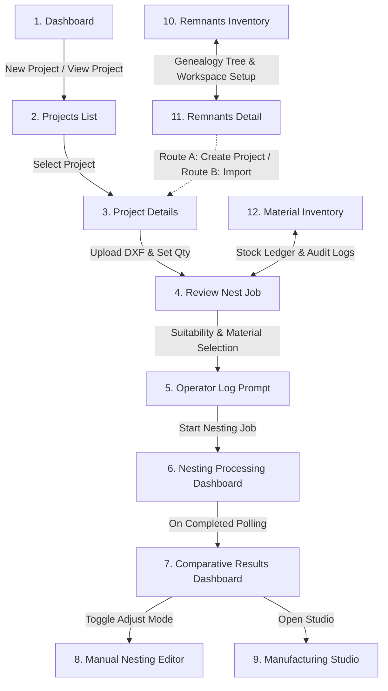

# 📐 SmartNest AI — Complete Product Workflow & Architecture Documentation

This document provides a comprehensive, start-to-finish engineering explanation of the **SmartNest AI** product architecture, processing pipelines, user journeys, and database schemas. It is written to serve as an authoritative product manual for designing an Interactive Manufacturing Walkthrough (guided tutorial).

---

## 1. Overall Product Architecture

From a user's perspective, SmartNest AI is an industrial CAD/CAM nesting optimization tool that manages raw material inventories, parses vector drawings, computes high-density genetic layouts, refines cutting toolpaths, and exports machine-ready G-code.

The system connects ten primary functional views:



### Flow Summary:
1. **Dashboard & Project Initialization**: The user views global statistics and creates or selects a Project matching the material type and thickness.
2. **CAD Upload & Queue Preparation**: In **Project Details**, raw `.dxf` vector drawings are uploaded. The system calculates each geometry's surface area. The user specifies quantities for each part.
3. **Material Source Selection & Feasibility Check**: In **Review Nest Job**, the user determines sheet stock sources (standard stock sheets, remnants, or newly declared sheets). An interactive **Bottom-Left-Fill (BLF)** packing simulator executes instantly to verify capacity and flag overlapping or oversized parts.
4. **Background Optimization**: The user enters their operator credentials. The backend spawns Node.js **Worker Threads** to calculate three distinct nesting strategy layouts concurrently.
5. **Nesting Progress Monitoring**: In **Nesting Processing**, the client polls stage updates from the backend every 1.5 seconds while showing a live canvas preview.
6. **Comparative Yield Analysis & Export**: In **Result**, the user toggles between Layout 1 (Compact), Layout 2 (Vertical Packing), and Layout 3 (Horizontal Packing). The Gemini AI advisor evaluates structural savings. The user exports a printable 8-page PDF manufacturing report, SVG layouts, or JSON coordinate maps.
7. **Manual Nest Refinement**: Toggling "Adjust Placements" launches the client-side canvas editor. Drag-and-drop actions are checked at 60fps for sheet containment and part-to-part collisions, authorized by the backend **Clipper collision library**.
8. **Genealogy Partitioning & Lock**: Saving and finalizing the layout triggers the **Parent-Child Partitioning Engine**. Clipper subtraction carves the leftover sheet into usable rectangular remnants and irregular scrap, saving them to inventory as `Available` while marking the parent sheets/remnants as `Consumed`.
9. **CAM Sequencer & Toolpaths**: In **Manufacturing Studio**, the user selects a target machine controller (Generic RS-274, GRBL Laser, LinuxCNC, or Mach3). They configure toolpath optimizations (Common Line Cutting, Chain Cutting, Pierce Minimization) and download the generated G-code.

---

## 2. Complete User Journey

This section tracks a manufacturing project's lifecycle from beginning to end.

### Step 1: Landing & Dashboard Navigation
* **Purpose**: Provide a summary of shop-floor nesting performance.
* **User Actions**: Review metrics cards, browse recent projects, and click **"New Project"**.
* **Inputs**: Search query (text).
* **Outputs**: Global counts (Active Projects, DXF Files, Nesting Jobs Run), and a recent projects table.
* **Buttons**: `New Project` (navigates to `/projects`), and `View Project` (navigates to `/projects/:id`).
* **Navigation**: Links to `Dashboard` (`/`), `Projects` (`/projects`), `Remnants` (`/remnants`), and `Material Inventory` (`/sheets`).
* **Backend Trigger**: `GET /api/projects/dashboard/stats` and `GET /api/projects`.
* **Validation**: Checks server connectivity; displays a red error alert if the database is offline.

### Step 2: Creating a Project Folder
* **Purpose**: Group parts of identical material specifications.
* **User Actions**: Click **"Create Project"** on the Projects page, fill out the modal form, and submit.
* **Inputs**: Project Name, Description, Material Type (dropdown selection: *Mild Steel*, *Stainless Steel 304*, *Aluminium*, *Copper*, *Brass*), and Thickness (positive decimal number in mm).
* **Outputs**: A new project record in the database.
* **Buttons**: `Create Project` (opens dialog), `Cancel` (closes dialog), and `Submit` (saves project).
* **Validation**:
  * Project Name is strictly required.
  * Material Thickness must be a positive number greater than 0.
* **What Happens Next**: Clicking "Create Project" executes a `POST` request, refreshes the projects grid, and allows the user to select the new card to navigate to `/projects/:id`.

### Step 3: Geometry Uploading & Quantity Control
* **Purpose**: Parse raw drawings and define quantities.
* **User Actions**: Drag or select a `.dxf` CAD file, edit the target quantities in the queue, and verify material parameters.
* **Inputs**: File upload dialog (`.dxf`), and Part quantity field (positive integer).
* **Outputs**: SVG rendering of parts and database records under `uploaded_files`.
* **Buttons**: `Next` (proceeds to review page), `Delete` (removes part from queue), and `Select File` (triggers upload).
* **Backend Trigger**:
  * `POST /api/files/upload` (Multer handles the file upload, writes it, triggers deepnest's converter at `https://converter.deepnest.app/convert`, saves the `.svg` preview, and calculates surface area).
  * `PUT /api/files/:id/quantity` (saves edited quantity).
* **Validation**:
  * Extension verification (accepts `.dxf` only).
  * Quantity must be a positive integer $\ge 1$.
* **What Happens Next**: Clicking `Next` navigates to `/projects/:id/review`. If no files are uploaded, `Next` is disabled.

### Step 4: Material Selection & Pre-Nest Suitability Checks
* **Purpose**: Map out sheets sequence and run a pre-nest packing test.
* **User Actions**: Set the base sheet preset dimensions (e.g. *1000x1000*, *2000x1000*, *3000x1500*, or *custom*), declare additional floor sheets, toggle allowed sources, and review the pre-nest suitability check metrics.
* **Inputs**: Sheet Preset, Custom Width, Custom Height, Allowed Sources checkboxes (*Stock*, *Remnants*, *New Sheets*), and Declared Floor Sheets (width, height, quantity).
* **Outputs**: Estimated sheets needed, expected utilization percentage, and a feasibility checklist mapping part fits.
* **Buttons**: `Add Sheet Card` (manual override), `Accept Recommendation`, and `Generate Nest` (triggers operator prompt).
* **Backend Trigger**:
  * `GET /api/remnants/recommend/:projectId` (pulls suitable remnants).
  * `POST /api/remnants/pre-nest/:projectId` (runs bottom-left-fill simulator).
* **Validation**:
  * Total configured sheet area must be sufficient for total parts area.
  * Parts cannot be physically larger than sheet dimensions (warns "Too Large").
  * Remnants cannot be selected multiple times.
* **What Happens Next**: Clicking `Generate Nest` opens a dialog prompting for `Operator Name` and `Operator Email`. Submitting triggers `POST /api/nesting/start/:projectId` and redirects to `/results/:jobId/processing`.

### Step 5: Background Nesting & Polling
* **Purpose**: Offload genetic optimization to worker threads without freezing the main server thread.
* **User Actions**: Observe progress indicators and wait for completion.
* **Inputs**: None (automated client-side polling).
* **Outputs**: Live canvas updates, current pipeline stage status, and elapsed processing time.
* **Backend Trigger**: `GET /api/nesting/status/:jobId?progressOnly=true` (polled every 1.5 seconds).
* **Validation**: If the worker thread crashes or returns an error, the pipeline marks the job as `failed` and displays a troubleshooting warning.
* **What Happens Next**: When status returns `completed`, the client clears timers and redirects to `/results/:jobId`.

### Step 6: Multi-Strategy Layout Results Comparative Dashboard
* **Purpose**: Compare packing results across three strategies.
* **User Actions**: Switch layout selection tabs, read AI recommendations, review cost breakdowns, and download exports.
* **Inputs**: Layout Selection tab, and AI Advisor toggle.
* **Outputs**: Utilization percentage, scrap recovery values, g-code time, and download links.
* **Buttons**: `Download Report (PDF)`, `Export Layout (SVG)`, `Export Placements (JSON)`, `Adjust Placements` (launches manual editor), and `Manufacturing Studio` (launches toolpath planner).
* **Backend Trigger**:
  * `GET /api/nesting/result/:jobId`.
  * `GET /api/ai/advisor/:jobId` (Gemini evaluation).
* **What Happens Next**: Clicking `Manufacturing Studio` routes the user to `/results/:jobId/studio?strategy=a` (or `b`/`c` matching the selected layout).

### Step 7: Manual Nesting Editor
* **Purpose**: Finely adjust nesting positions.
* **User Actions**: Drag parts around the sheet, rotate using keyboard or mouse wheel, add/remove parts, click Undo/Redo, and save the layout.
* **Inputs**: Coordinate inputs, rotation inputs, and canvas drag gestures.
* **Outputs**: Live containment (green/red outline) and saved placements coordinate lists.
* **Keyboard Shortcuts**: `R` (rotate 90°), `Delete` / `Backspace` (remove part), and `Esc` (cancel placement preview).
* **Backend Trigger**:
  * `PUT /api/nesting/layout/:jobId` (saves placements to database).
  * `POST /api/nesting/layout/validate/:jobId` (Clipper collision test).
* **What Happens Next**: User exits editor and returns to Results view.

### Step 8: Layout Finalization
* **Purpose**: Lock the layout, deduct inventory, and harvest leftovers.
* **User Actions**: Click **"Finalize Layout"** and confirm the prompt.
* **Outputs**: Layout state set to `Finalized`. Sheet inventory balances are updated. New remnants are added to stock.
* **Backend Trigger**: `POST /api/nesting/finalize/:jobId`.
* **Validation**: Triggers verification ensuring layout is not already finalized. If finalized, warns operator to prevent accidental overrides.

### Step 9: Toolpath Optimization & G-Code Export
* **Purpose**: Sequence laser head moves and download machine programs.
* **User Actions**: Pick a Target Controller, choose weight profiles, toggle toolpath optimizations (CLC, chaining, pierce), run the sequencing animation, and download G-code.
* **Inputs**: Profile Key (dropdown), Target Controller (dropdown), and Optimization checkboxes.
* **Outputs**: Animated cutter simulation, toolpath sequencer log table, and G-code file.
* **Buttons**: `Play/Pause/Reset`, `Download G-Code`, and `Back to Layout`.
* **Backend Trigger**: `GET /api/studio/gcode/:jobId`.
* **What Happens Next**: G-code downloads directly to the user's computer. The project cycle completes.

---

## 3. Every Screen

This inventory maps routes, components, panels, dialogs, and features across the UI.

### 3.1. System Dashboard
* **Route**: `/`
* **React Component**: [Dashboard](file:///e:/smartnest-ai/frontend/src/pages/Dashboard.jsx)
* **Purpose**: Main portal showing layout throughput stats.
* **Major Panels**:
  * **System Metrics Grid**: Cards containing counts of projects, parsed DXFs, and nested runs.
  * **Recent Projects Table**: Lists the 5 most recent project folders, showing their name, description, date created, and navigation buttons.
* **Buttons**: `New Project` (top-right), and `View Project` (table row).

### 3.2. Projects Page
* **Route**: `/projects`
* **React Component**: [Projects](file:///e:/smartnest-ai/frontend/src/pages/Projects.jsx)
* **Purpose**: Create and delete project folders.
* **Major Panels**:
  * **Projects Cards Grid**: Renders individual cards detailing creation dates, materials, and description text.
* **Dialogs**:
  * **Create New Project Dialog**: Contains input fields for project name, description, material type, and material thickness.
* **Buttons**: `Create Project` (header), `Manage` (card), and `Delete` (card).

### 3.3. Project Details Page
* **Route**: `/projects/:id`
* **React Component**: [ProjectDetails](file:///e:/smartnest-ai/frontend/src/pages/ProjectDetails.jsx)
* **Purpose**: Part queue list and DXF upload panel.
* **Major Panels**:
  * **DXF Parts Queue (Left)**: Table showing uploaded part names, upload timestamps, quantity editors, and deletion buttons.
  * **Upload Geometry Source (Right)**: Drag-and-drop dashed container for DXF uploading.
  * **Project Meta Card (Top)**: Form panel containing material type and thickness parameters.
* **Buttons**: `Next` (navigates to review page), `Upload` (triggers file selector), and `Delete Part`.

### 3.4. Review Nest Job Page
* **Route**: `/projects/:id/review`
* **React Component**: [ReviewNestJob](file:///e:/smartnest-ai/frontend/src/pages/ReviewNestJob.jsx)
* **Purpose**: Pre-nesting parameters configuration, suitability checks, and stock allocations.
* **Major Panels**:
  * **Estimated Job Summary Card Grid**: Displays estimated sheet counts, default target utilization (82%), total part count, and total part surface area.
  * **Nesting Strategy Selection Panel**: Radio buttons to select Greedy, Genetic Fast, Genetic Balanced, or Genetic Maximum optimization settings.
  * **Planning Assistant (Collapsible Accordion)**: Sequence cards matching required parts against raw stock, floor inventory, and remnants.
  * **Manual Configuration Sheet Grid**: Cards depicting individual sheet sources and bounds.
  * **Mini CAD Viewport**: Renders the selected sheet's boundary and remnants geometry using Canvas.
* **Dialogs**:
  * **Operator Log Prompt**: Inputs for Operator Name and Email.
  * **Validation Error Dialog**: Lists missing inputs (e.g. unselected remnants, custom dimensions missing, or deficit material).
* **Buttons**: `Generate Nest`, `Add Sheet Card`, `Accept Recommendation`, `Zoom In/Out`, and `Reset Zoom`.

### 3.5. Nesting Processing Dashboard
* **Route**: `/results/:jobId/processing`
* **React Component**: [NestingProcessingDashboard](file:///e:/smartnest-ai/frontend/src/pages/NestingProcessingDashboard.jsx)
* **Purpose**: Live polling progress dashboard.
* **Major Panels**:
  * **Pipeline Progress Tracker (Left)**: Table detailing the status of the 9 stages (Waiting, Running, Completed).
  * **Live Viewport Canvas (Center)**: Displays active packing shapes.
  * **Job Statistics Card**: Shows active parameters, elapsed time, and strategy sub-statuses.
* **Visualizations**: Interactive sheet bounds rendering showing parsed parts in real time.

### 3.6. Results Dashboard
* **Route**: `/results/:jobId`
* **React Component**: [Result](file:///e:/smartnest-ai/frontend/src/pages/Result.jsx)
* **Purpose**: Nested layout comparative review and CAM launcher.
* **Major Panels**:
  * **Nesting Quality Metrics Grid**: Renders total plate weights, plate costs, scrap values, and optimization runtime.
  * **AI Advisor Recommendations Panel**: Centered box showing Gemini structural evaluation logs.
  * **Interactive CAD Viewer Canvas**: Displays layout geometries. Supports pan and zoom.
  * **Layout Selection Tabs**: Switching between Layout 1 (Compact), Layout 2 (Vertical), and Layout 3 (Horizontal).
  * **Layout Statistics Detail Table (Bottom-Right)**: Details 13 layout-specific metrics.
  * **AI Copilot Sidebar**: Chat prompt to interact with Gemini regarding optimization issues.
* **Buttons**: `Finalize Layout`, `Download Report (PDF)`, `Export Layout (SVG)`, `Export Placements (JSON)`, `Adjust Placements`, and `Manufacturing Studio`.

### 3.7. Manufacturing Studio
* **Route**: `/results/:jobId/studio`
* **React Component**: [ManufacturingStudio](file:///e:/smartnest-ai/frontend/src/pages/ManufacturingStudio.jsx)
* **Purpose**: CAM simulator, toolpath sequencing, and G-code export center.
* **Major Panels**:
  * **Sheets Explorer (Left)**: Vertical strip listing layouts and scrap values.
  * **Simulation Canvas (Center)**: HTML5 Canvas animating cutter movements (traverse, pierce, cut).
  * **Metrics Panel (Right)**: Control box to choose profiles (Standard, Travel, Heat, Quality, Production) and toggle optimization plugins.
  * **Toolpath Operation Sequencer Table (Bottom)**: Detailed step-by-step logs mapping coordinates, feed rates, action types, and optimization reasoning.
* **Buttons**: `Play/Pause/Reset`, `Speed Toggle` (1x, 2x, 5x, 10x), `Download G-Code`, and `Back to Layout`.

### 3.8. Remnants Inventory Page
* **Route**: `/remnants`
* **React Component**: [Remnants](file:///e:/smartnest-ai/frontend/src/pages/Remnants.jsx)
* **Purpose**: Overview of reusable remnant sheet assets.
* **Major Panels**:
  * **Remnants Cards Grid / Table View**: Displays remnant previews, IDs, material types, remaining dimensions, and estimated value.
  * **Filter Bar**: Dynamic drop-downs to filter by material, status (Available, Reserved, Consumed, Partially Used, Archived), type (Standard vs Scrap), and search text.

### 3.9. Remnant Details Page
* **Route**: `/remnants/:id`
* **React Component**: [RemnantDetail](file:///e:/smartnest-ai/frontend/src/pages/RemnantDetail.jsx)
* **Purpose**: Anatomy breakdown and setup workspace.
* **Major Panels**:
  * **Anatomy Preview Workspace**: Visualizes the remnant's geometry.
  * **Genealogy Lineage Tree**: Interactive flowchart showing parent stocks, active remnants, and child segments.
  * **Dimensions Card Grid**: Renders estimated scrap rate, thickness, remaining area, and remaining width/height.
* **Dialogs**:
  * **Workspace Setup Modal**: Select Route A (Create New Project) or Route B (Import into Project) with thickness matching.
* **Buttons**: `Use Remnant`, and `Use Scrap`.

### 3.10. Material Inventory Page
* **Route**: `/sheets`
* **React Component**: [Sheets](file:///e:/smartnest-ai/frontend/src/pages/Sheets.jsx)
* **Purpose**: Track raw sheets and log stock audit transactions.
* **Major Panels**:
  * **Inventory Table**: Renders standard stock profiles in warehouse storage.
  * **Consumption History Table**: Lists dates, sheets sizes, and projects that consumed standard sheets.
  * **Remnants Usage History**: Records remnant consumption dates and operator logs.
  * **Inventory Audit Logs**: Transaction ledger recording stock creation, updates, and deletion events.
* **Dialogs**:
  * **Add Material Stock Dialog**: Inputs for sheet size, material, quantity, storage location, and operator log.
  * **Update Sheet Stock Dialog**: Adjust quantities and locations with audit log reason inputs.
  * **Delete Sheet Stock Dialog**: Triggers stock deletion with reason audit logging.
  * **Clear History Dialog**: Administrative logs clear authorization page.

---

## 4. Project Lifecycle

This section tracks the step-by-step processing lifecycle of a single Project:

```
[Project Created]
       ↓
[Parts Uploaded (.dxf)]
       ↓
[DXF Converted to SVG (Converter API)]
       ↓
[SVG Cleaned (Preprocessor)]
       ↓
[Polygons Extracted (Welded & Grouped)]
       ↓
[Geometry Simplified (Douglas-Peucker 1.5% BB tolerance)]
       ↓
[Material Sources Configured (Stock / Remnants)]
       ↓
[BLF Suitability Check Passed]
       ↓
[Nesting Run Started (Worker Thread spawned)]
       ↓
[Progress Polling (NestingProcessingDashboard)]
       ↓
[Comparative Results Rendered (Layout 1 / 2 / 3)]
       ↓
[Optional: Manual Placements (Canvas Editor)]
       ↓
[Layout Finalized (Parent sheets marked Consumed; Leftovers partitioned into Available remnants/scrap)]
       ↓
[Manufacturing Studio (Toolpaths sequenced by weights)]
       ↓
[Optimization Plugins Applied (CLC / Chaining / Pierce)]
       ↓
[Simulation Verified]
       ↓
[G-Code Post-Processed & Exported]
```

### Description of Intermediate Stages:
* **Geometry Simplification**: The system applies the Douglas-Peucker algorithm using a tolerance of 1.5% of the bounding box to reduce vertex counts for the genetic solver. Crucially, the system retains the high-resolution coordinates separately (`originalPoints` and `originalChildren`) for high-fidelity vector rendering and G-code output.
* **Leftover Partitioning**: Uses Clipper subtraction routines to subtract nested parts from the sheet boundary. The remaining geometry is saved as a parent remnant (marked `Consumed`). If the remaining boundary contains a rectangular envelope larger than $50 \times 50\text{ mm}$ and has an area $\ge 5000\text{ mm}^2$, it is registered as an `Available` rectangular remnant. Remaining leftover segments matching the thresholds are saved as `Available` scrap pieces.
* **Toolpath Sequencing weights**: The toolpaths are sequenced by sorting profiles matching specific factor weights:
  * **Travel Optimized**: Traverses directly to the nearest-neighbor centroid.
  * **Heat Balanced**: Sequentially skips adjacent areas to avoid thermal warping.
  * **Quality Optimized**: Balances thermal factors, travel, and continuous gantry motion.
  * **Production Optimized**: Prioritizes feed speeds and pierce times.

---

## 5. Feature Inventory

Categorized inventory of every user-facing feature in SmartNest AI:

### 5.1. Project Management
* Project Folder Creation (material-specific scoping).
* Queue upload list with file area calculations.
* Part quantity override controls.
* Complete project deletion (cascades upload files and jobs).

### 5.2. Material & Inventory Control
* Master sheet catalog ledger (add, update, delete standard plates).
* Multi-source configuration (allowed stock, remnants, newly declared stock).
* Warehouse storage location audits.
* Genealogy tracking (trace parent stock sheet down to active remnants and scrap).
* Administrative history clearing audits.

### 5.3. Pre-Nesting Suitability Analyzer
* JavaScript Bottom-Left-Fill (BLF) packing simulator.
* Projected sheet utilization metrics indicator.
* Feasibility part checklist (flags oversized shapes).

### 5.4. Nesting Core Optimization
* Genetic solver offloaded to dedicated **Worker Threads**.
* Concurrent Multi-Strategy Nesting:
  * **Layout 1**: Bounding-box compaction (Compact).
  * **Layout 2**: Strip packing vertically (Vertical).
  * **Layout 3**: Strip packing horizontally (Horizontal).
* Optimization levels adjustments: Greedy (instant), Fast (10 generations), Balanced (50 generations), Maximum (200 generations).
* Interactive layout selection comparison view.

### 5.5. Manual Layout Editor
* Drag-and-drop workspace canvas.
* 60fps containment check (visual green/red safe outline).
* C++ Clipper collision engine integration (authorizes final placements).
* Keyboard rotations and shortcuts (`R` / `Delete` / `Backspace` / `Esc`).
* Undo / Redo placement stack.

### 5.6. Manufacturing Studio (CAM)
* Sequenced cutter head travel animation.
* Playback speeds (1x, 2x, 5x, 10x).
* Sequencer log table detailing coordinates, feed rates, action types, and optimization reasoning.
* Post-processor selections: GRBL Laser, LinuxCNC, Mach3, Generic RS-274.
* Travel Optimization profiles: Travel, Heat, Quality, Production.
* Optimization plugins: Common Line Cutting (CLC), Chain Cutting, Pierce minimization.

### 5.7. Professional Export Center
* printable 8-page PDF report.
* Scaled vector SVG layout formats.
* JSON placements coordinates databases.

### 5.8. Generative AI Advisor
* Gemini-powered layout advisor (summaries, savings estimates).
* AI Copilot chat prompt.

---

## 6. Important Concepts Users Need To Learn

Key concepts beginners typically find confusing, and where they appear in SmartNest:

1. **DXF (Drawing Exchange Format)**
   * *Concept*: A CAD vector file format containing drawing coordinates. Unlike raster images (JPEG/PNG), DXF maps paths.
   * *App Location*: Appears in **Project Details** upload drawer and the **Parts Queue**.
2. **Polygon Hierarchy (Outer Bounds vs Holes)**
   * *Concept*: A closed loop boundary. In nesting, parts are represented as polygon hierarchies, where outer loops are parent parts and inner loops are holes/cutouts. Nested parts can be placed inside internal holes of larger parts.
   * *App Location*: Visualized in the **Manual Editor** canvas and the **Nesting processing** live viewport.
3. **Usable Remnant**
   * *Concept*: Usable leftover material salvaged from a completed job, which is returned to warehouse inventory. In SmartNest, remnants are specifically rectangular sheets extracted from leftovers.
   * *App Location*: Appears in **Remnants Inventory**, **Review Nest Job** sheets configuration, and **Remnant Details**.
4. **Scrap Offcut**
   * *Concept*: Leftover material that exceeds minimum size thresholds but possesses an irregular boundary shape. Usable for custom manual placements but excluded from automated standard recommendations.
   * *App Location*: Appears under **Irregular Scrap / Offcuts** tabs in **Remnants Inventory**.
5. **NFP (No-Fit Polygon)**
   * *Concept*: A Minkowski Sum calculation that maps the boundary coordinates within which two irregular polygons will overlap. Used by the genetic engine to prevent part collisions.
   * *App Location*: Executed invisibly by the backend deepnest-next genetic optimization runner.
6. **Utilization vs Net Utilization**
   * *Concept*: *Utilization* measures total part area divided by total sheet area. *Net Utilization* measures total part area divided by the bounding envelope area of nested parts (indicating compaction quality).
   * *App Location*: Appears in **Result** stats cards and the PDF Report.
7. **Lead-In & Lead-Out**
   * *Concept*: Auxiliary toolpaths where the cutter pierces the metal outside the part boundary and cuts inwards. This prevents the initial pierce blow-hole from damaging the final component boundary.
   * *App Location*: Visualized in **Manufacturing Studio** as orange (pierce), blue (lead-in/out), and green (cutting) vectors.
8. **Pierce**
   * *Concept*: The action of burning through raw sheet metal before commencing a cut contour. Piercing takes time and wears down cutter nozzles.
   * *App Location*: Configured and tracked in **Manufacturing Studio** metrics panels.
9. **Rapid Move**
   * *Concept*: Movements where the laser gantry moves at maximum speed with the cutting nozzle turned off (traverse travel). Traverses should be minimized.
   * *App Location*: Visualized as red dashed paths in **Manufacturing Studio**.
10. **Post Processor**
    * *Concept*: A translation script that converts raw vector toolpaths into machine-specific G-code dialects (e.g. converting paths to Mach3-compatible G-code).
    * *App Location*: Found in **Manufacturing Studio** under "Target Controller".
11. **G-Code**
    * *Concept*: CNC programming language containing directions (G00 rapid move, G01 linear feed, M03 laser fire) read by the machine controller.
    * *App Location*: Exported in **Manufacturing Studio** via "Download G-Code".

---

## 7. SmartNest Processing Pipeline

This table correlates backend services with the frontend pages where they are triggered and displayed:

| Pipeline Step | Backend Controller / Service | Triggered by Page | Displayed on Page |
| :--- | :--- | :--- | :--- |
| **1. DXF Upload** | `fileController.uploadDxfFile` | `ProjectDetails` | `ProjectDetails` |
| **2. SVG Conversion** | `nestingService.runDeepnestNext` | `ProjectDetails` (area calculation) / `ReviewNestJob` | `ProjectDetails` queue |
| **3. Polygon Extraction** | `nestingService.groupPolygonsByHierarchy` | `ReviewNestJob` (suitability run) / `NestingProcessingDashboard` | `NestingProcessingDashboard` |
| **4. DeepNest Execution** | `nestingWorker.js` / `nestingService.js` | `ReviewNestJob` (Generate Nest) | `NestingProcessingDashboard` / `Result` |
| **5. Collision Checks** | `api.validatePlacement` / Clipper | `Result` (Manual adjustments drag/drop) | `Result` (canvas) |
| **6. Yield Statistics** | `costingService.js` / `nestingController.js` | `nestingWorker.js` (Completed state) | `Result` (metrics cards) |
| **7. Partition Engine** | `nestingController.finalizeJob` / Clipper | `Result` (Finalize Layout) | `Remnants` inventory |
| **8. Toolpath Generation**| `studioService.js` / `optimizationPipeline.js` | `ManufacturingStudio` (fetchToolpathData) | `ManufacturingStudio` |
| **9. Post-Processing** | `genericGCodePostProcessor.js` | `ManufacturingStudio` (Download G-Code) | Downstream CNC machine |

---

## 8. Hidden Processes Worth Teaching

These background calculations happen automatically but are invisible to users, making them excellent educational highlights for a guided tutorial:

1. **Douglas-Peucker Polygon Simplification**
   * *Mechanism*: Smooths curves by removing dense vertices that do not change geometry outline. Reduces genetic solver load.
   * *Educational Value*: Explaining that SmartNest nests a simplified proxy shape but cuts the high-resolution original CAD line ensures operators understand why the layout calculations run fast without losing drawing detail.
2. **NFP (No-Fit Polygon) Caching**
   * *Mechanism*: Computes overlap boundaries for pairs of shapes. The system invalidates cached NFPs whenever placements hashes change.
   * *Educational Value*: Informs the user why consecutive runs of similar geometry groups complete faster.
3. **Usable Rectangle Partitioning Thresholds**
   * *Mechanism*: The Clipper subtraction subtraction engine carves usable rectangular offcuts. It screens them against a strict threshold: Minimum Area $\ge 5000\text{ mm}^2$, Minimum Width $\ge 50\text{ mm}$, Minimum Height $\ge 50\text{ mm}$. Anything failing this checks is classified as irregular scrap.
   * *Educational Value*: Guides users on how size parameters determine if leftovers can be loaded into inventory.
4. **Area Conservation Verification**
   * *Mechanism*: Integrates a mathematical check on layout finalization: $\text{Parent Leftover Area} = \text{Rectangular Remnant Area} + \sum \text{Scrap Pieces Area}$. If the difference exceeds $1\%$, a console warning is flagged.
   * *Educational Value*: Demonstrates calculation accuracy to operators.
5. **Pierce Minimization (Common Line & Chain Cutting)**
   * *Mechanism*: If two parts share an edge, Common Line Cutting rewrites geometry paths to cut the shared line once, saving one cut and one pierce. Chain cutting links consecutive contours with bridges, cutting multiple parts in a single pierce action.
   * *Educational Value*: Highlights how advanced CAM reduces pierce damage and cycle times.

---

## 9. Existing Sample Data

The codebase contains the following sample data assets that can be preloaded for guided tutorials:

* **CAD Drawings Dataset**: Located in [DXF DATASET](file:///e:/smartnest-ai/DXF%20DATASET). Contains 20 industrial profiles:
  * `01_circle_D50.dxf` & `02_circle_D100.dxf` (Basic Circles).
  * `03_square_50x50.dxf` & `04_square_100x100.dxf` (Basic Squares).
  * `05_rectangle_100x50.dxf` & `06_rectangle_200x100.dxf` (Basic Rectangles).
  * `07_triangle_equilateral_100mm.dxf` (Triangle).
  * `08_pentagon.dxf`, `09_hexagon.dxf` & `10_octagon.dxf` (Polygons).
  * `11_mounting_plate_4holes.dxf` & `12_mounting_plate_8holes.dxf` (Plates with internal cutouts).
  * `13_circular_flange_plate.dxf` & `14_motor_base_plate_with_slots.dxf` (Slotted components).
  * `15_L_bracket.dxf`, `16_U_bracket.dxf` & `17_T_bracket.dxf` (Structural brackets).
  * `18_gusset_plate.dxf`, `19_machine_cover_plate.dxf` & `20_electrical_panel_cutout_plate.dxf` (Enclosures).

---

## 10. Screens That Would Benefit From Guided Explanation

Educational opportunities within the application that should be covered in the walkthrough:

1. **Review Nest Job Page**
   * *Opportunity*: Explain why **Operator Name & Email** are logged (tracks inventory transactions and audit trials).
   * *Opportunity*: Explain the bottom-left-fill suitability yield. Teach users to add more sheets if the suitability checker warns of a capacity deficit.
2. **Comparative Results Dashboard**
   * *Opportunity*: Clarify the difference between Layout 1, 2, and 3 strategies. Explain why vertical or horizontal packing options might be preferred over a simple compact bounding-box layout (e.g. to preserve continuous vertical sheet strips).
   * *Opportunity*: Teach the user how **Net Utilization** indicates placement efficiency compared to simple sheet area consumption.
3. **Manual Nesting Editor**
   * *Opportunity*: Introduce keyboard shortcuts. Provide visual prompts for `R` to rotate and mouse wheel scrolling.
   * *Opportunity*: Explain why the part borders outline in red (overlap collision or boundary breach) and how Clipper checks prevent crashes.
4. **Manufacturing Studio**
   * *Opportunity*: Explain how different sequence profiles (Travel vs Heat Balanced) affect the material. (e.g. heat balanced sequencing prevents thermal deformation in thin sheets by distributing laser heat).
   * *Opportunity*: Explain how Common Line Cutting and Chain Cutting save pierce operations, reducing nozzle wear and cycle times.

---

## 11. Navigation Map

This map outlines all pages, routes, and possible transitions within SmartNest AI:

```
[Dashboard] (Route: /)
    ↓ (Click "New Project" button / "Projects" sidebar link)
[Projects] (Route: /projects)
    ↓ (Click "Manage" on project card)
[Project Details] (Route: /projects/:id)
    ↓ (Click "Next" button in project meta panel)
[Review Nest Job] (Route: /projects/:id/review)
    ↓ (Click "Generate Nest" button, fill Operator details, submit)
[Nesting Processing Dashboard] (Route: /results/:jobId/processing)
    ↓ (Automated polling redirect on Completed status)
[Result] (Route: /results/:jobId)
    ├─→ [Result - Edit Mode] (Toggle "Adjust Placements" switch)
    ├─→ [Result - AI Copilot Sidebar] (Click Chat/Copilot Icon)
    └─→ [Manufacturing Studio] (Route: /results/:jobId/studio?strategy=a)

[Remnants] (Route: /remnants)
    ↓ (Click "Details" on remnant card)
[Remnant Detail] (Route: /remnants/:id)
    ↓ (Click "Use Remnant" -> Dialog workspace setups)
    ├─→ Route A: [Projects - Create New from remnant details] 
    └─→ Route B: [Project Details - Import remnant as stock sheet boundary]

[Material Inventory] (Route: /sheets)
    ├─→ [Stock Inventory Tab] (Add, edit, delete sheets)
    ├─→ [Consumption History Tab] (View usage records)
    ├─→ [Remnants Usage History Tab] (Track consumed remnants)
    └─→ [Audit Logs Tab] (Review inventory ledger events)
```

---

## 12. Appendix

Reference lists of routes, controllers, and services in SmartNest AI.

### 12.1. Component and Page Mapping
* **Dashboard Layout**: [DashboardLayout](file:///e:/smartnest-ai/frontend/src/layouts/DashboardLayout.jsx) (Route Shell)
* **Dashboard Page**: [Dashboard](file:///e:/smartnest-ai/frontend/src/pages/Dashboard.jsx) (Route: `/`)
* **Projects Page**: [Projects](file:///e:/smartnest-ai/frontend/src/pages/Projects.jsx) (Route: `/projects`)
* **Project Details**: [ProjectDetails](file:///e:/smartnest-ai/frontend/src/pages/ProjectDetails.jsx) (Route: `/projects/:id`)
* **Review Nest Page**: [ReviewNestJob](file:///e:/smartnest-ai/frontend/src/pages/ReviewNestJob.jsx) (Route: `/projects/:id/review`)
* **Nesting Processing**: [NestingProcessingDashboard](file:///e:/smartnest-ai/frontend/src/pages/NestingProcessingDashboard.jsx) (Route: `/results/:jobId/processing`)
* **Results Comparative View**: [Result](file:///e:/smartnest-ai/frontend/src/pages/Result.jsx) (Route: `/results/:jobId`)
* **Manufacturing Studio**: [ManufacturingStudio](file:///e:/smartnest-ai/frontend/src/pages/ManufacturingStudio.jsx) (Route: `/results/:jobId/studio`)
* **Remnants inventory**: [Remnants](file:///e:/smartnest-ai/frontend/src/pages/Remnants.jsx) (Route: `/remnants`)
* **Remnants details**: [RemnantDetail](file:///e:/smartnest-ai/frontend/src/pages/RemnantDetail.jsx) (Route: `/remnants/:id`)
* **Material Inventory**: [Sheets](file:///e:/smartnest-ai/frontend/src/pages/Sheets.jsx) (Route: `/sheets`)

### 12.2. Shared UI components
* **CAD Canvas View**: [LayoutCanvas](file:///e:/smartnest-ai/frontend/src/components/LayoutCanvas.jsx) (Renders geometries on SVG canvas)
* **Parts Library Sidebar**: [PartsLibrary](file:///e:/smartnest-ai/frontend/src/components/PartsLibrary.jsx) (Lists parts for manual placement)
* **Manual Nest Toolbar**: [Toolbar](file:///e:/smartnest-ai/frontend/src/components/Toolbar.jsx) (Undo/redo, delete, zoom controls)
* **Manual Nest Placement Editor Sidebar**: [EditingSidebar](file:///e:/smartnest-ai/frontend/src/components/EditingSidebar.jsx) (Manual position/rotation coordinate text inputs)
* **Manual Nest Shifter**: [CoordinateShifter](file:///e:/smartnest-ai/frontend/src/components/CoordinateShifter.jsx) (Shift all parts on canvas by offsets)
* **Intelligent Fill panel**: [IntelligentFillPanel](file:///e:/smartnest-ai/frontend/src/components/IntelligentFillPanel.jsx) (Autofills sheets with grid arrays)
* **CAM Canvas View**: [StudioCanvas](file:///e:/smartnest-ai/frontend/src/components/StudioCanvas.jsx) (Simulates animated toolpaths)
* **CAM Control panel**: [StudioMetricsPanel](file:///e:/smartnest-ai/frontend/src/components/StudioMetricsPanel.jsx) (Displays toolpath properties and controls optimization profiles)
* **Layout Stats breakdown**: [Statistics](file:///e:/smartnest-ai/frontend/src/components/Statistics.jsx) (Detailed yield statistics)

### 12.3. Key Backend Controllers
* **Projects**: [projectController](file:///e:/smartnest-ai/backend/src/controllers/projectController.js) (CRUD projects, update material specifications)
* **Files**: [fileController](file:///e:/smartnest-ai/backend/src/controllers/fileController.js) (uploads DXF, parsing triggers, deletes parts, quantity edits)
* **Nesting Jobs**: [nestingController](file:///e:/smartnest-ai/backend/src/controllers/nestingController.js) (initiates background worker, retrieves status, saves manual placements, layout finalization, remnant partitioning)
* **Remnants**: [remnantController](file:///e:/smartnest-ai/backend/src/controllers/remnantController.js) (lists inventory, recommendations matching projects, details)
* **Sheets Stock**: [sheetController](file:///e:/smartnest-ai/backend/src/controllers/sheetController.js) (manages inventory sheets, history ledgers, audit trail records)
* **AI Advisor**: [aiController](file:///e:/smartnest-ai/backend/src/controllers/aiController.js) (live evaluation summaries and cost estimates via Gemini)
* **Copilot Chat**: [copilotController](file:///e:/smartnest-ai/backend/src/controllers/copilotController.js) (conversational chat with Gemini advisor)
* **Manufacturing Studio**: [studioController](file:///e:/smartnest-ai/backend/src/controllers/studioController.js) (calculates toolpath segments and downloads G-code)

### 12.4. Important Backend Services
* **Nesting Service**: [nestingService](file:///e:/smartnest-ai/backend/src/services/nestingService.js) (converts drawings, parses SVG contours, runs simplify curves, MinkowskiSum genetic core execution wrapper)
* **Nesting Worker Thread**: [nestingWorker](file:///e:/smartnest-ai/backend/src/workers/nestingWorker.js) (executes runs on background threads)
* **CAM Sequencer**: [studioService](file:///e:/smartnest-ai/backend/src/services/studioService.js) (maps coordinate transformations, calculates feed speeds, manages cache details)
* **Optimization Pipeline**: [optimizationPipeline](file:///e:/smartnest-ai/backend/src/services/optimizationPipeline.js) (sequences toolpaths, estimates G-code runtimes, triggers plugins)
* **Common Line Cutting (CLC)**: [geometryOptimizer](file:///e:/smartnest-ai/backend/src/services/geometryOptimizer.js) (identifies shared edges and merges paths)
* **Chain Cutting**: [chainOptimizer](file:///e:/smartnest-ai/backend/src/services/chainOptimizer.js) (links contours with bridges)
* **Pierce Optimizer**: [pierceOptimizer](file:///e:/smartnest-ai/backend/src/services/pierceOptimizer.js) (sequences pierce locations)
* **Toolpath Integrity Checker**: [integrityGuard](file:///e:/smartnest-ai/backend/src/services/integrityGuard.js) (validates toolpaths to prevent sheet edge collisions)
* **AI Recommendation Engine**: [aiService](file:///e:/smartnest-ai/backend/src/services/aiService.js) (interacts with Gemini API `gemini-2.5-flash` using `@google/genai` library)
* **Cost Estimator**: [costingService](file:///e:/smartnest-ai/backend/src/services/costingService.js) (calculates material densities, price rates, scrap values)
* **Inventory Management**: [inventoryService](file:///e:/smartnest-ai/backend/src/services/inventoryService.js) (deducts stock balances, registers consumed remnants)
* **Post Processors**: [genericGCodePostProcessor](file:///e:/smartnest-ai/backend/src/services/genericGCodePostProcessor.js) (formats coordinates into G-code dialect blocks matching machine profile specifications)

### 12.5. REST API Schema Reference

#### 12.5.1. Projects
* `GET /api/projects` - Retrieves all projects.
* `GET /api/projects/:id` - Retrieves a specific project folder.
* `POST /api/projects` - Creates a project card.
  * *Request Body*: `{ user_id, project_name, description, materialType, materialThickness }`
* `POST /api/projects/create-from-remnant` - Generates a project matching remnant materials.
  * *Request Body*: `{ remnantId, project_name, description }`
* `DELETE /api/projects/:id` - Deletes a project card.
* `PUT /api/projects/:id/material` - Updates project material type/thickness parameters.
  * *Request Body*: `{ materialType, materialThickness }`
* `GET /api/projects/dashboard/stats` - Retrives global system analytics.

#### 12.5.2. Geometries & Files
* `GET /api/files/project/:projectId` - Retrieves files list for project.
* `POST /api/files/upload` - Uploads a DXF drawing.
  * *Request Body* (Multipart Form): `project_id` (Integer), `file` (Binary), `quantity` (Integer).
* `DELETE /api/files/:id` - Deletes a file record.
* `PUT /api/files/:id/quantity` - Modifies a part's queue quantity.
  * *Request Body*: `{ quantity }`
* `GET /api/files/geometry/:id` - Retrieves parsed SVG geometry coordinates.

#### 12.5.3. Nesting Runs & Manual Editor
* `POST /api/nesting/start/:projectId` - Launches background solver.
  * *Request Body*: `{ optimizationLevel, sheetWidth, sheetHeight, remnantId, nestingMode, operatorName, operatorEmail, configuredSheets }`
* `GET /api/nesting/status/:jobId` - Polls status. Uses query `?progressOnly=true` for progress stages.
* `GET /api/nesting/result/:jobId` - Retrieves layout results and statistics.
* `GET /api/nesting/layout/:jobId` - Loads placements coordinates for manual adjustments.
  * *Query Parameter*: `?strategy=`
* `PUT /api/nesting/layout/:jobId` - Saves manual layout placements.
  * *Request Body*: `{ parts, strategy }`
* `POST /api/nesting/reset/:jobId` - Resets placements back to initial Auto Nest results.
* `POST /api/nesting/regenerate/:jobId` - Recomputes layouts.
* `POST /api/nesting/finalize/:jobId` - Finalizes layouts, updating stock inventory balances.
* `POST /api/nesting/layout/validate/:jobId` - Backend Clipper collision test.
  * *Request Body*: `{ candidate, placements }`
* `POST /api/nesting/layout/intelligent-fill/:jobId` - Array fill planner.
  * *Request Body*: `{ placements, partsToDuplicate, limits, gridStep, rotations }`

#### 12.5.4. Inventory Sheets & Audit logs
* `GET /api/sheets` - Retrieves warehouse stock ledger.
* `POST /api/sheets` - Adds standard sheet plate stock.
  * *Request Body*: `{ width, height, materialType, materialThickness, quantity, storageLocation, addedBy, email }`
* `PUT /api/sheets/:id` - Updates quantity/location with audit tracking details.
  * *Request Body*: `{ quantity, storageLocation, updatedBy, email, reason }`
* `DELETE /api/sheets/:id` - Deletes sheet inventory logs with audit details.
  * *Request Body*: `{ deletedBy, email, reason }`
* `GET /api/sheets/history` - Retrieves consumption history list.
* `GET /api/sheets/remnant-history` - Retrieves remnant history list.
* `GET /api/sheets/audit-logs` - Retrieves stock transaction audits ledger.
* `DELETE /api/sheets/history/clear` - Clears consumption ledger logs.
  * *Request Body*: `{ clearedBy, email, reason }`
* `DELETE /api/sheets/remnant-history/clear` - Clears remnant usage ledger logs.
  * *Request Body*: `{ clearedBy, email, reason }`
* `DELETE /api/sheets/audit-logs/clear` - Clears audit logs ledger.
  * *Request Body*: `{ clearedBy, email, reason }`

#### 12.5.5. Reusable Remnants
* `GET /api/remnants` - Lists available remnants.
  * *Query Parameter*: `?isScrap=`
* `GET /api/remnants/:id` - Retrieves a remnant record and parent-child genealogy tree.
* `GET /api/remnants/recommend/:projectId` - Recommends compatible remnants.
* `POST /api/remnants/pre-nest/:projectId` - Runs bottom-left-fill simulator feasibility check.
  * *Request Body*: `{ remnantId, sheetWidth, sheetHeight }`

#### 12.5.6. AI Services
* `GET /api/ai/advisor/:jobId` - Retrieves Gemini-powered design advisor reports.
  * *Query Parameter*: `?enabled=`
  * *Header*: `x-ai-advisor-enabled`
* `POST /api/copilot/chat` - Submits a question to the AI Copilot.
  * *Request Body*: `{ jobId, message }`

#### 12.5.7. Manufacturing Studio
* `GET /api/studio/toolpath/:jobId` - Generates sequenced toolpath operations.
  * *Query Parameters*: `strategy`, `clc` (Boolean), `chaining` (Boolean), `pierceOpt` (Boolean).
* `GET /api/studio/gcode/:jobId` - Downloads machine controller-ready G-code.
  * *Query Parameters*: `strategy`, `sheetIdx` (Integer), `profileKey`, `clc` (Boolean), `chaining` (Boolean), `pierceOpt` (Boolean), `machineProfile`.
