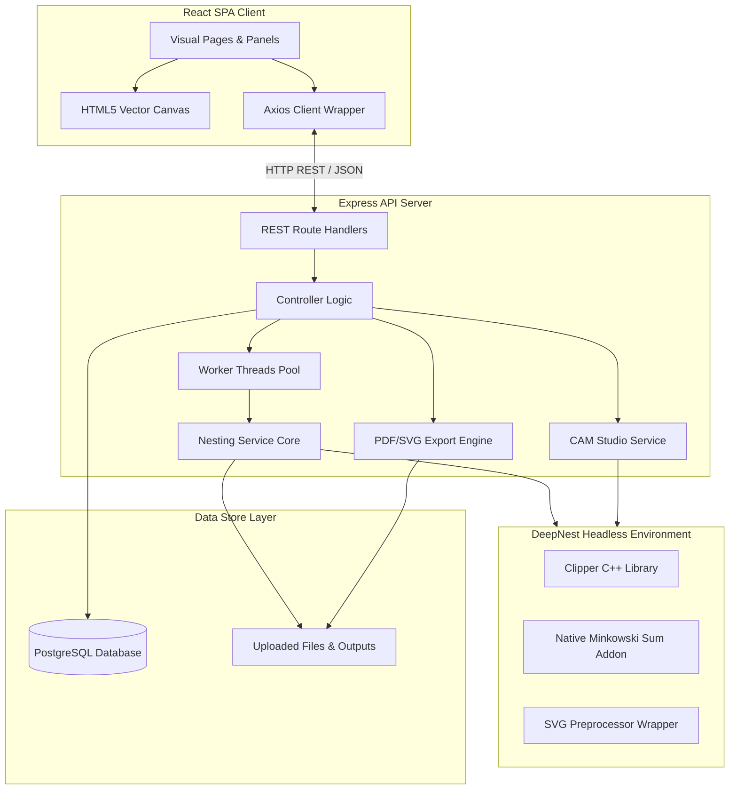
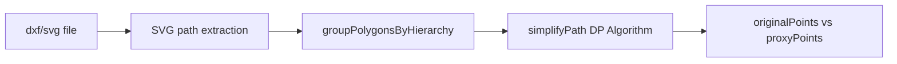
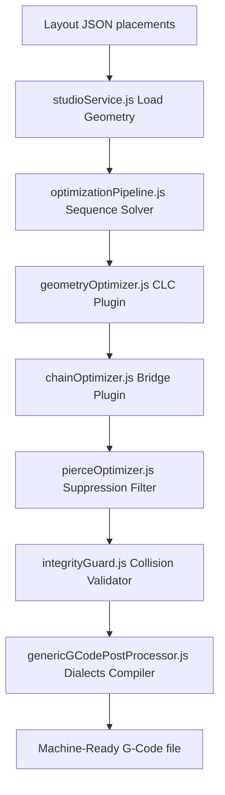

# 📐 SmartNest AI — Definitive Technical Knowledge Document & Architecture Manual
**Version:** 1.2-Stable  
**Authoritative System & CAM/Nesting Reference Manual**

---

## 1. Project Overview

### What SmartNest AI Is
SmartNest AI is an industrial-grade, web-based CAD/CAM nesting optimization application and inventory management platform. It allows manufacturing operators to upload vector drawing files (CAD files in DXF or SVG formats), dynamically pack them onto sheet metal plates (nesting) using advanced genetic algorithms, manually adjust their positions in an interactive vector editor, compute toolpath optimizations, simulate cutting operations, and download CNC-ready G-code. Additionally, it integrates a closed-loop raw sheet and remnant stock ledger to track and harvest unused material (remnants and scrap) back into warehouse inventory.

### Primary Objectives
* **Minimize Material Waste:** Optimize 2D packing yields using genetic algorithm heuristics.
* **Reduce Machine Cycle Times:** Minimize idle traverse movement, cutting lengths, and piercing operations via toolpath optimization.
* **Bridge CAD/CAM with ERP Inventory:** Establish a closed-loop ledger tracking standard raw material consumption and remnants generation/reuse.
* **Empower Operators with AI:** Deploy Generative AI (Gemini) to serve as a design advisor and optimization copilot on the shop floor.

### Target Users
* **CNC Machine Operators:** Operators loading G-code, running simulations, and selecting stock sources.
* **Production Planners / CAD Designers:** Personnel preparing DXF CAD models, defining part queues, and managing inventories.
* **Shop Managers:** Supervisors tracking plate yields, manufacturing efficiency, material cost margins, and remnants recovery metrics.

### Real-World Workflow
```
[CAD Design (DXF)] 
       ↓ 
[Upload & Area Calculation] 
       ↓ 
[Material & Remnant recommendation] 
       ↓ 
[BLF Suitability Check] 
       ↓ 
[Background Nesting Worker Run] 
       ↓ 
[Comparative Yield Analysis] 
       ↓ 
[Optional: Manual Refinement (Canvas Editor)] 
       ↓ 
[Layout Finalization & Deduct Stock] 
       ↓ 
[Harvest Remnants & Scrap] 
       ↓ 
[Manufacturing Studio (CAM Toolpaths)] 
       ↓ 
[G-Code Generation & Download] 
       ↓ 
[CNC Cutting Machine Execution]
```

### How SmartNest Differs from ProNest
SmartNest AI is engineered as a modern, web-native CAD/CAM dashboard that addresses key drawbacks of legacy desktop nesting systems like Hypertherm's ProNest:
* **Cloud-Native Headless Execution:** Runs nesting optimization within server-side Node.js worker threads rather than requiring expensive desktop hardware keys or local Windows licenses.
* **Closed-Loop Remnant Genealogy Tree:** Dynamically tracks remnant parent-child relationships and auto-partitions irregular leftover plates into standard rectangular sheets and irregular scrap offcuts, registering them directly in inventory.
* **AI-Assisted Fabrication Insights:** Integrates an LLM advisor (Gemini) to evaluate placement yields and recommend cost savings, nozzle heat profiles, or design adjustments directly.
* **No-Install CAD/CAM Workspaces:** Multi-strategy layouts, toolpath animation simulations, and manual canvas drag-and-drop actions operate inside a standard web browser at 60fps.

---

## 2. Complete Architecture

### High-Level System Architecture
SmartNest AI is built as a decoupled, multi-tiered web application consisting of a React Single-Page Application (SPA) frontend, an Express-based Node.js backend REST API, and a PostgreSQL database.



### Frontend Architecture
* **React & Vite:** The frontend is initialized as a Vite-powered React Single-Page Application.
* **Material-UI (MUI):** UI layout widgets, dialogs, dropdowns, buttons, and layouts leverage MUI components styled with custom CSS.
* **HTML5 Canvas Vector Viewports:** Drawing files and layouts are rendered on a responsive, custom 2D canvas supporting multi-touch zooming, panning, and 60fps drag-and-drop coordinates shifting.
* **Axios API Client:** Client state interactions are mapped through a centralized Axios configuration wrapper (`frontend/src/services/api.js`).

### Backend Architecture
* **Express Router:** Endpoints are separated into feature-focused routers (files, projects, remnants, nesting, sheets, copilot, studio, guide).
* **Asynchronous Multi-Worker Pool:** CPU-intensive genetic optimizations are offloaded from the main event loop to dedicated Node.js `worker_threads` (`backend/src/workers/nestingWorker.js`).
* **Headless DeepNest Environment:** Bypasses heavy desktop UI code by mocking global browser boundaries (such as `window`, `document`, `alert`, and `self`), letting standard Clipper and Minkowski bindings run directly inside server processes.

### DeepNest Integration & Minkowski Addons
The optimization engine relies on native C++ additions from the `deepnest-next` repository:
* **`@deepnest/calculate-nfp`:** A native Node.js wrapper executing the C++ Minkowski Sum algorithm to generate exact overlap boundaries (No-Fit Polygons) for irregular shapes.
* **`@deepnest/svg-preprocessor`:** An SVG parsing library that translates raw paths into normalized polygon vertices.
* **Clipper C++ Library:** A compiled library executing robust boolean polygon clipping operations (difference, union, intersection) at high scale.

### Geometry Processing Layer
* **Douglas-Peucker Simplification:** Compresses vertex counts by smoothing curves within a tolerance of 1.5% of the bounding box width/height.
* **Hierarchy Resolving Engine:** Evaluates clockwise vs counter-clockwise polygon orientations to distinguish outer contours (parent parts) from internal holes/cutouts (child parts).
* **High-Fidelity Coordinate Preservation:** Caches high-precision geometries separately (`originalPoints` and `originalChildren`) to ensure downstream G-code and SVG outputs retain CAD precision.

### Manufacturing Studio (CAM Engine)
* **Optimization Pipeline:** Sequences nozzle traverse movements according to weighted factor metrics.
* **Cutter Compensation (Lead-In/Lead-Out):** Adds auxiliary paths (orange/blue circles and vectors) so toolhead pierce damage occurs outside final part boundaries.
* **CAM Plugin Adapters:** Inject Common Line Cutting (CLC), continuous Chain Cutting bridges, and Pierce Suppression filters.

### Storage Layer
* **PostgreSQL Relational DB:** Manages tables for projects, users, files, nesting jobs, standard sheet inventory ledgers, remnants, and audit history logs.
* **Local Filesystem Store:** Standardizes raw DXF CAD files, preprocessed SVGs, generated layout JSON maps, and compiled G-code files in `backend/src/uploads/` directories.

---

## 3. Complete User Workflow

### Screen 1: Dashboard
* **Purpose:** High-level summary of active shop floor metrics and folder access.
* **Inputs:** Search query text.
* **Outputs:** Metrics cards (Active Projects count, Uploaded CADs count, Completed Runs count), recent projects table.
* **Navigation:** Sidebar links to Projects, Remnants, Material Inventory, and Guided Tutorials.
* **State Management:** Local React state `stats` loaded on component mount.
* **Interaction with Backend:** Executes `GET /api/projects/dashboard/stats` and `GET /api/projects`.

### Screen 2: Workspaces / Projects List
* **Purpose:** Create, browse, or delete material-specific project folders.
* **Inputs:** Search text, "Create Project" form modal fields (Name, Description, Material Type dropdown, Thickness number in mm).
* **Outputs:** Card grid showing metadata, thickness parameters, and creation timestamps.
* **Navigation:** Clicking "Manage" on a card routes the user to the Project Details view.
* **State Management:** React state `projects` array and `isModalOpen` boolean flag.
* **Interaction with Backend:** Executes `POST /api/projects` and `GET /api/projects`.

### Screen 3: Project Details
* **Purpose:** DXF CAD file uploading and part quantity configuration.
* **Inputs:** File selector drag-and-drop panel (accepts `.dxf` or `.svg`), Part quantity inputs (integers $\ge 1$).
* **Outputs:** Parts queue table showing filenames, creation dates, quantity editors, and part surface area calculations.
* **Navigation:** Clicking "Next" routes the user to the Review page.
* **State Management:** Redux-like React state updating part queues locally after quantity edits.
* **Interaction with Backend:** Runs `POST /api/files/upload`, `PUT /api/files/:id/quantity`, and `DELETE /api/files/:id`.

### Screen 4: Review Nest Job
* **Purpose:** Sheets source planning and Bottom-Left-Fill (BLF) packing simulation checks.
* **Inputs:** Stock source checkboxes (Stock sheets, Remnants, New Custom plates), Sheet size presets, custom dimensions, selected remnants, Declared Floor Sheets.
* **Outputs:** Estimated sheet counts, utilization projection bars, feasibility checklist (flags "Too Large" parts), and a mini CAD preview canvas.
* **Navigation:** Clicking "Generate Nest" routes to Processing view.
* **State Management:** Coordinates sheets sequences, remnants array, and BLF simulation parameters.
* **Interaction with Backend:** Call `GET /api/remnants/recommend/:projectId` and `POST /api/remnants/pre-nest/:projectId`.

### Screen 5: Nesting Processing Dashboard
* **Purpose:** Non-blocking monitoring of active optimization worker stages.
* **Inputs:** None (automated AJAX timer execution).
* **Outputs:** Pipeline progress tracker table (9 stages), live canvas showing active parts packing, elapsed time, and optimization status.
* **Navigation:** Auto-redirects to the Results dashboard upon worker completion.
* **State Management:** Local progress states refreshed every 1.5 seconds.
* **Interaction with Backend:** Polls `GET /api/nesting/status/:jobId?progressOnly=true`.

### Screen 6: Comparative Results Dashboard
* **Purpose:** Side-by-side strategy evaluations, manual adjustments, and exports.
* **Inputs:** Layout strategy tabs (Compact, Vertical, Horizontal), Gemini advisor toggle.
* **Outputs:** Canvas showing layout drawings, stats cards (utilization, cutting time, costs, weight, runtimes), layout statistics detail table (13 metrics), and Gemini recommendations.
* **Navigation:** Routes to Manual Editor or Manufacturing Studio.
* **State Management:** Strategy toggles update active layout parameters and redraw the canvas.
* **Interaction with Backend:** Fetch `GET /api/nesting/result/:jobId`, `POST /api/nesting/finalize/:jobId`, and `GET /api/ai/advisor/:jobId`.

### Screen 7: Manual Nesting Editor
* **Purpose:** Fine-tune nested parts placement on the sheet.
* **Inputs:** Drag gestures, scroll wheel rotation, text coordinates, keyboard hotkeys.
* **Outputs:** Canvas with containment boundary alerts (green outline for valid position, red outline for collision).
* **Navigation:** Exits back to Results page.
* **State Management:** Undo/Redo stack arrays, placement modifications tracking, and unsaved changes state.
* **Interaction with Backend:** Runs `POST /api/nesting/layout/validate/:jobId` (Clipper collision) and `PUT /api/nesting/layout/:jobId` (save).

### Screen 8: Manufacturing Studio
* **Purpose:** CAM simulation, sequencing profiles selection, and G-code compiler.
* **Inputs:** Target Controller profile, Travel Optimization profile, CLC/Chaining/Pierce optimization switches, simulation speeds (1x, 2x, 5x, 10x).
* **Outputs:** Simulated traverse/cut vectors animation, step-by-step sequencer log table.
* **Navigation:** Returns to Results page.
* **State Management:** Simulation playback clocks, speed dividers, and active profile weights parameters.
* **Interaction with Backend:** Call `GET /api/studio/toolpath/:jobId` and `GET /api/studio/gcode/:jobId`.

### Screen 9: Remnants Inventory
* **Purpose:** Search and manage reusable sheet metal remnants and scrap offcuts.
* **Inputs:** Material type, status, scrap type, and search filters.
* **Outputs:** Previews list cards, estimated value, and remnant width/height.
* **Navigation:** Access remnant detail sheets.
* **State Management:** Pagination state and filters configuration.
* **Interaction with Backend:** Calls `GET /api/remnants`.

### Screen 10: Remnants Detail Page
* **Purpose:** Genealogy lineage analysis and project mapping.
* **Inputs:** Project selection modal details.
* **Outputs:** Vector remnant outline, dimensions, parent stocks, and children branches flowcharts.
* **Navigation:** Routes to new project creation or exports remnant as stock sheet boundary to an existing project.
* **State Management:** Lineage node maps.
* **Interaction with Backend:** Runs `GET /api/remnants/:id` and `POST /api/projects/create-from-remnant`.

### Screen 11: Material Stock Ledger
* **Purpose:** Track standard raw plates and audit transactions history.
* **Inputs:** Stock adjustments forms, location fields, audit reasons texts.
* **Outputs:** Master warehouse inventory table, stock consumption ledger, remnants history logs, and transaction audit logs.
* **State Management:** Stock ledger modifications states.
* **Interaction with Backend:** Calls `GET /api/sheets`, `POST /api/sheets`, `PUT /api/sheets/:id`, `DELETE /api/sheets/:id`, `GET /api/sheets/history`, `GET /api/sheets/remnant-history`, and `GET /api/sheets/audit-logs`.

---

## 4. Feature-by-Feature Analysis

### DXF/SVG Upload & Area Calculation
* **Upload Drawer:** Handles drag-and-drop CAD files using `multer` on the backend.
* **Area Calculation:** The system parses DXF drawings, translates contours to SVG paths, extracts vertices, and applies the Shoelace formula (polygon area) via `GeometryUtil.polygonArea()` to determine surface area. The computed area is saved to `uploaded_files.area` in the database.

### Material Inventory & Standard Sheets
* **Ledger Management:** Operates a warehouse database storing standard sheet dimensions, quantities, and storage locations.
* **Consumption History:** Finalizing layout runs deducts raw stock and updates historical ledger entries automatically.

### Custom Sheets & Irregular Boundaries
* Supports nesting directly on irregular boundaries (such as a previously cut remnant plate with complex notches or internal holes).
* The vector canvas renders custom sheets using SVG `evenodd` fill paths. The genetic solver respects these complex geometries, constraining part placement within the outer boundary while avoiding internal holes.

### Polygon Extraction & Curve Simplification
* **Polygon Extraction:** Converts curves, lines, and arcs to closed coordinate arrays using the SVG preprocessor.
* **Douglas-Peucker Simplification:** Runs recursive curve simplification with a tolerance of 1.5% of the bounding box to strip high-density vertices, speed up nesting algorithms, and keep the solver responsive.

### Headless Genetic Optimization
* Spawns worker threads executing the genetic solver.
* Mutates sheet order, part placements, and rotations (4 quadrants standard).
* Minimizes a composite fitness score to pack parts tightly.

### The Three Layout Strategy Types
1. **Layout 1 (Compact Strategy):** Packs parts into a tight bounding box in the bottom-left corner of the sheet, minimizing the total bounding box area.
2. **Layout 2 (Vertical Strategy):** Packs parts tightly into vertical strips, minimizing horizontal growth. Employs bounding box height as a secondary tie-breaker. Ideal for preserving long vertical remnants.
3. **Layout 3 (Horizontal Strategy):** Packs parts tightly into horizontal strips, minimizing vertical growth. Employs bounding box width as a secondary tie-breaker. Ideal for preserving long horizontal remnants.

### Remnant Reuse & Leftover Partitioning
* **Usable Rectangle Partitioning:** Subtracts nested parts from the sheet boundary using Clipper. It searches the leftover geometry for the largest empty rectangle using a grid solver.
* **Harvesting Thresholds:** If the rectangle is larger than $50 \times 50\text{ mm}$ and has an area $\ge 5000\text{ mm}^2$, it is registered as an `Available` rectangular remnant.
* **Scrap Offcuts Recovery:** Leftover segments outside the rectangular boundary are evaluated against the same thresholds. If they pass, they are saved as `Available` irregular scrap. Both standard remnants and scrap reference their parent stock via `parent_remnant_id`, maintaining a complete genealogy tree.

### Manual Editor Canvas & 60fps Checks
* **Drag-and-Drop Editor:** Translates parts along a 10mm grid. Part rotations are adjusted in 15° steps using the mouse wheel, or by 90° using the `R` key.
* **60fps Bounding Box Pre-checks:** Client-side canvas code performs rapid bounding box intersection tests against the sheet boundaries and other parts. It highlights valid placements in green and collisions in red.
* **Authoritative Clipper Check:** Saving layout changes calls backend C++ Clipper routines to perform exact polygonal intersection checks, preventing part overlaps.

### AI Advisor & Optimization Copilot
* **AI Advisor:** Packages layout metrics (utilization, cutting length, scrap values, cycle time, remnants) and sends them to Gemini (`gemini-2.5-flash`) via the official `@google/genai` SDK. Gemini returns a structured JSON containing design feedback, advantages, and savings estimates.
* **AI Copilot Sidebar:** Provides an interactive chat workspace where operators can ask optimization questions. It includes a strict keyword filter that rejects out-of-scope queries (e.g. coding, general trivia, weather), returning: `"I can only assist with SmartNest manufacturing and nesting related questions."`

### Scaled Vector & Report Exports
* **SVG Export:** Generates scaled SVG files with outer sheets, nested part outlines, part numbers, and internal cutouts.
* **JSON Placements Map:** Exports coordinate mappings (`x`, `y`, `rotation`, `sheetId`, `filename`) for importing layouts into secondary software.
* **8-Page PDF Report:** Generates a structured PDF layout containing a cover page, individual strategy analysis pages, vector preview drawings, and a side-by-side comparative summary table.

---

## 5. Deep Technical Explanation

### 5.1. Geometry Pipeline
The geometry pipeline processes CAD drawings to prepare them for nesting:



1. **Path Extraction:** Multer handles the file upload. DXF files are sent to the conversion server `https://converter.deepnest.app/convert`, which returns an SVG string.
2. **Hierarchy Resolving:** `groupPolygonsByHierarchy` analyzes path winding rules (clockwise vs counter-clockwise) to map outer boundaries (parent parts) and internal cutouts (child holes).
3. **Curve Simplification:** The Douglas-Peucker algorithm simplifies complex curves to speed up nesting:
   * It calculates the bounding box of the polygon.
   * Tolerance is set to 1.5% of the bounding box size: `tolerance = Math.max(1.0, max(width, height) * 0.015)`.
   * It runs the Douglas-Peucker algorithm to simplify the polygon.
   * Original coordinates are stored separately in `originalPoints` and `originalChildren` to ensure G-code output and visual rendering retain full precision.

### 5.2. Placement Pipeline
`placeParts` executes bottom-left nesting using Minkowski Sums and Clipper:
1. **Inner NFP Containment:** Resolves allowable placement boundaries within the sheet container.
2. **Outer NFP Collision Map:** Calculates No-Fit Polygons (NFP) between placed parts and candidate parts using Minkowski sums to prevent overlaps.
3. **Clipper Subtract Resolution:** Subtracts outer NFPs from the inner NFP using Clipper:
   `FinalNFP = InnerNFP - Union(OuterNFPs)`
   This yields a set of valid coordinates where the candidate part's reference point can be placed without colliding.
4. **Strategy Optimization Placement:** Selects the best coordinate from the valid candidates based on the active strategy:
   * **Compact:** Minimizes bounding box area.
   * **Vertical:** Minimizes `max X` coordinate.
   * **Horizontal:** Minimizes `max Y` coordinate.

### 5.3. Optimization Pipeline
Sequences toolpaths on the sheet using a cost-driven nearest-neighbor solver:
1. **Contour Extraction:** Extracts all internal holes and outer contours as individual cuts.
2. **Holes-First Constraint Check:** Enforces that all internal holes of a part are cut before the outer boundary is cut. This prevents the part from detaching from the sheet bed, which would cause alignment errors.
3. **Weighted Cost Solver:** Evaluates candidate cuts by calculating a composite cost score:
   `Cost = w_heat * normHeat + w_travel * normTravel + w_continuity * normContinuity + w_time * normTime`
4. **Thermal Dissipation Model:** Evaluates localized heat concentration at candidate centroids based on a decay model of previously cut locations:
   `Heat = sum( H0 * exp(-lambda * (currentStep - nodeStep)) / (distanceSq + epsilon) )`
   * `H0` (initial heat), `lambda` (thermal dissipation), and `epsilon` (heat buffer) are material-specific parameters (e.g. Stainless Steel has lower dissipation than Aluminium, so heat spreads slower and lingers longer).
5. **Continuous Trajectory Scoring:** Evaluates angular direction changes and changes in travel distance jumps to prevent sudden gantry movements.

### 5.4. Manufacturing Pipeline
Compiles sequenced operations (rapid traverse, pierce, cut) into G-code:
1. **Common Line Cutting (CLC):** Detects adjacent parts with parallel collinear edges within 2mm alignment tolerance and a minimum overlap of 5mm. It rewrites the geometry to cut the shared edge once, saving cutting time and a pierce operation.
2. **Chain Cutting:** Connects consecutive part contours with a bridge to cut them in a single continuous movement. The bridge is accepted only if the cutting time of the bridge is less than the travel time plus pierce time:
   `D_bridge < T_pierce / (1/V_feed - 1/V_traverse)`
3. **Pierce Optimizer:** Suppresses `PIERCE` and `RAPID_MOVE` operations at bridge connections, allowing the cutter to remain on and continue cutting.
4. **Post-Processor Dialects:** Translates operations into target G-code dialects (units, coordinates, laser power, path blending, constant velocity).

---

## 6. Optimization Analysis

The table below details the performance benefits and trade-offs of each optimization:

| Optimization | Purpose | Performance Benefit | Trade-offs | Affected Modules |
| :--- | :--- | :--- | :--- | :--- |
| **Douglas-Peucker Curve Simplification** | Reduces vertex density on curves. | Speeds up genetic nesting iterations and NFP calculations. | Slight proxy dimensional variance during solver phase. | `nestingService.js` |
| **NFP Cache database** | Caches Minkowski Sum overlap polygons for part pairs. | Drastically reduces runtime of subsequent nesting runs for identical parts. | Requires cache invalidation on layout modifications. | `nestingService.js`, `activeJobsProgress` |
| **Holes-First Constraint** | Ensures child holes are cut before outer contours. | Prevents part movement or detachment during cutting, improving quality. | May increase traverse travel distances. | `optimizationEngine.js`, `qualityScoring.js` |
| **Common Line Cutting (CLC)** | Merges shared edges of adjacent parts. | Saves one pierce operation and reduces cutting length by the shared edge length. | Requires adjacent parts to be parallel and aligned. | `geometryOptimizer.js`, `optimizationPipeline.js` |
| **Chain Cutting Bridges** | Connects parts with a cut bridge. | Eliminates pierce operations by cutting connected parts in a single pass. | Leaves a small bridge mark on the cut parts. | `chainOptimizer.js`, `pierceOptimizer.js` |
| **Safety Timeout Watchdog** | Terminates sequencing optimizations if runtime exceeds 2 seconds. | Prevents the API from hanging on complex nesting jobs. | Falls back to the baseline Standard profile. | `optimizationPipeline.js` |
| **Overtravel Tolerance Checks** | Validates coordinates against sheet boundaries. | Prevents machine damage by catching boundary violations in G-code. | Rejects coordinates that exceed sheet bounds. | `genericGCodePostProcessor.js` |

---

## 7. Manufacturing Studio

### CAM Architecture & Operations Model
The Manufacturing Studio converts nested layout configurations into CNC machine instructions.



### Lead-In & Lead-Out Parameters
To prevent piercing damage from spoiling the final part contour:
* **Lead-In:** Adds a 2.0mm entry path (visualized in blue) starting outside the part boundary and cutting inwards.
* **Lead-Out:** Adds a 1.0mm exit path (visualized in blue) cutting outwards from the end of the contour.

### Machine Profiles & Post-Processors
The system supports four machine controller profiles:
1. **Generic RS-274:** Metric units (G21), absolute positioning (G90), tool start (M03), tool stop (M05), and program end (M30). Generates `.gcode` files.
2. **GRBL Laser:** Uses dynamic laser power mode (M04) with PWM power control (S1000). Generates `.gcode` files.
3. **LinuxCNC:** Standard routing G-code supporting path blending tolerances (`G64 P0.1`). Generates `.ngc` files.
4. **Mach3:** Standard milling G-code supporting constant velocity mode (`G64`). Generates `.tap` files.

---

## 8. Project Folder Structure

### Folder Map
```
smartnest-ai/
├── .agents/                    # Behavioral constraints and coding instructions
├── backend/                    # Node.js Express server workspace
│   ├── src/
│   │   ├── config/             # Database connection, schemas, and migrations
│   │   ├── controllers/        # Express route controllers
│   │   ├── middleware/         # Auth, validation, and error handlers
│   │   ├── routes/             # Express API routers
│   │   ├── services/           # Business logic, math solvers, and exports
│   │   ├── uploads/            # DXF files, SVGs, and layout JSONs
│   │   └── workers/            # Worker thread optimization runner
│   ├── server.js               # Application starter
│   └── package.json            # Backend package configurations
├── frontend/                   # React Vite project workspace
│   ├── src/
│   │   ├── assets/             # Global visual styling assets
│   │   ├── components/         # Shared React widgets and vector canvases
│   │   ├── layouts/            # Navigation shells
│   │   ├── pages/              # Primary application views
│   │   ├── services/           # Axios API connection client
│   │   ├── App.jsx             # React router configuration
│   │   └── main.jsx            # React client mount point
│   ├── vite.config.js          # Vite build manager
│   └── package.json            # Frontend package configurations
├── DXF DATASET/                # Sample CAD drawings library
└── README.md                   # System configuration overview
```

### Folder Interactions
* **CAD Upload Flow:** The React client uploads a DXF file to `fileRoutes.js`. `fileController.js` saves the file in `uploads/` and calls `nestingService.js` to parse the geometry.
* **Nesting Optimization Flow:** `nestingController.js` spawns a worker thread (`nestingWorker.js`) which runs `nestingService.js` algorithms using dependencies from `ai-service/deepnest-next/` (Clipper, Minkowski Sum). The results are saved back to the `uploads/` folder as SVG and JSON files.
* **CAM & G-Code Flow:** `studioController.js` calls `studioService.js` to process the layout JSON, generate optimized toolpaths, and compile them into G-code using `genericGCodePostProcessor.js`.
* **Export Flow:** `exportController.js` calls `exportService.js` to parse layout files, convert SVGs to PNGs using `sharp`, generate reports using `pdfkit`, and serve them for download.

---

## 9. Technologies Used

### Frontend Stack
* **React (v19):** Component-based architecture for SPA state management.
* **Vite:** High-speed asset compilation and hot-reloading.
* **Material-UI (v9):** Visual design system containing widgets, icons, grids, and dialog overlays.
* **HTML5 Canvas API:** Custom 2D CAD viewer that renders sheets, parts, zoom/pan operations, and drag-and-drop actions at 60fps.

### Backend Stack
* **Node.js & Express:** Lightweight, asynchronous server stack.
* **PostgreSQL (pg):** Handles structured relational database storage.
* **Worker Threads:** Offloads genetic optimization to background threads to keep the main Express server responsive.

### Geometry & Math Stack
* **Clipper Library:** Compiled C++ library that handles boolean polygon clipping operations (difference, union, intersection) and collision checks.
* **Minkowski Sum Addon (`@deepnest/calculate-nfp`):** Native binding that calculates No-Fit Polygons for irregular geometries.
* **SVG Preprocessor Addon (`@deepnest/svg-preprocessor`):** Parses SVG strings into coordinate arrays.
* **Douglas-Peucker (DP) Algorithm:** Simplifies curves to speed up nesting calculations.
* **Shoelace Formula:** Calculates polygon areas.

### AI Stack
* **Google Gemini API (`gemini-2.5-flash`):** Provides design and nesting optimization recommendations.
* **`@google/genai` (v2.8.0):** Official SDK for the Gemini API.

### Utility & Export Stack
* **PDFKit (v0.19):** Generates structured A4 PDF manufacturing reports.
* **Sharp (v0.35):** Converts SVG layouts to high-resolution PNGs for embedding in PDF reports.
* **Multer:** Handles multipart/form-data file uploads.

---

## 10. Engineering Challenges Solved

### 10.1. CPU Event Loop Blocking
* **Problem:** Running genetic nesting calculations on a single thread blocked the Express event loop, causing API requests to hang and make the server unresponsive.
* **Solution:** Spawns nesting runs within dedicated Node.js `worker_threads` using `nestingWorker.js`. The main thread remains responsive to status queries and API requests.
* **Impact:** High-traffic polling requests resolve instantly (<5ms) without hanging. Sockets and database client references are closed naturally when the worker thread finishes, preventing database connection leaks.

### 10.2. Precision Mismatch (Simplification vs. Cutting)
* **Problem:** Simplifying complex curves to speed up genetic calculations reduced the accuracy of the final cut, resulting in parts that did not match the original CAD design.
* **Solution:** Caches the original high-resolution points (`originalPoints` and `originalChildren`) separately. The simplified geometry is used only as a proxy for collision detection during nesting.
* **Impact:** The genetic solver runs quickly, while the visual canvas and exported G-code retain full CAD precision.

### 10.3. Remnant Inventory Leaks & Collisions
* **Problem:** Tracking irregular remnants in inventory often caused overlaps and collisions because the remnants were stored as simple rectangles.
* **Solution:** Clipper subtraction calculates exact leftover shapes (outer boundaries and inner holes) and saves them as JSONB in the database.
* **Impact:** The system supports nesting on irregular remnants, and collision checks respect complex boundaries.

### 10.4. Watchdog Timeout & Safety Rollbacks
* **Problem:** Large nesting jobs with many parts could cause the CAM sequencing optimization loop to run slowly or hang, blocking the server.
* **Solution:** Implements a safety timeout watchdog set to 2 seconds. If the optimization run exceeds this limit, the system aborts and falls back to the baseline Standard profile.
* **Impact:** Ensures the server remains stable, while `integrityGuard.js` validates toolpaths to catch any layout errors before exporting G-code.

---

## 11. Current Strengths
* **Decoupled Architecture:** Express API server, React frontend, and C++ geometry engines operate independently.
* **Headless Integration:** Native Minkowski calculations run directly in Node.js without requiring a desktop environment.
* **Multi-Strategy Nesting:** Computes Compact, Vertical, and Horizontal layouts concurrently to let operators pick the best yield.
* **Closed-Loop Remnants Harvesting:** Carves usable rectangular remnants and irregular scrap from leftovers and saves them to inventory with complete parent-child lineage tracking.
* **Explainable AI Integration:** The Gemini-powered advisor and copilot provide structural feedback and cost-saving recommendations.

---

## 12. Current Limitations
* **Single-Node Event Loop:** Worker threads run in parallel, but high traffic could overload CPU resources if not managed by a processing queue.
* **No 3D Boundary Support:** Geometry processing is restricted to 2D profiles; 3D designs (STEP/IGES) must be converted to 2D DXF or SVG files before uploading.

---

## 13. Future Extension Points
* **Distributed Redis Job Queue:** Offload worker threads to a background task queue (such as BullMQ with Redis) to handle high traffic and manage CPU resources.
* **Multi-Sheet Nesting:** Extend the genetic algorithm to distribute part placement across multiple consecutive sheets.
* **Dynamic Lead-In Position Tuning:** Automatically move lead-in pierce points away from adjacent parts to prevent heat damage.
* **Laser-Head Collision Avoidance:** Add algorithms to plan travel paths that bypass already cut parts, preventing the nozzle from colliding with tilted pieces.

---

## 14. End-to-End Data Flow

```
1. DXF Upload
   [React UI] --(POST Multipart)--> [fileController.js] --> [Multer writes file]
                                        ↓
                                    [nestingService.js] --> [Converter API] --> [Write SVG preview]

2. Pre-Nest Suitability
   [Review Page] --(POST parameters)--> [remnantController.js] --> [Enrich SVG dimensions]
                                                                        ↓
                                                                   [Run 15mm BLF simulation]
                                                                        ↓
                                                                   [Return yield & feasibility checklist]

3. Nesting Execution
   [Start Nesting] --(POST parameters)--> [nestingController.js] --> [Spawn Worker Thread]
                                                                          ↓
                                                                     [nestingWorker.js]
                                                                          ↓
                                                                     [genetic algorithm / placeParts]
                                                                          ↓
                                                                     [Write SVG & JSON outputs]

4. Manual Layout Tweaks
   [Drag-and-drop Part] --> [Canvas coordinates update] --> [Validate Collision (Clipper)]
                                                                ↓
                                                            [Save Layout -> Update JSON]

5. Layout Finalization
   [Finalize Layout] --(POST)--> [nestingController.js]
                                     ├─> [Clipper subtracts nested parts from sheet]
                                     ├─> [usableRectangle -> Save Available standard remnant]
                                     ├─> [scrapPieces -> Save Available scrap remnant]
                                     ├─> [Verify Area Conservation]
                                     └─> [deductSheetsConsumed / recordRemnantUsage]

6. CAM Optimization
   [Open Studio] --(GET)--> [studioController.js]
                                 ↓
                            [studioService.js] --> [Resolve Feed Rates]
                                 ↓
                            [optimizationPipeline.js]
                                 ├─> [Optimize sequence & apply CLC]
                                 ├─> [Apply Chaining Bridges & Pierce Suppression]
                                 └─> [validateToolpath (Integrity Guard)]

7. G-Code Generation
   [Download G-Code] --(GET)--> [studioController.js]
                                    ↓
                                [genericGCodePostProcessor.js]
                                    ├─> [validateOperations]
                                    ├─> [validateGCode Overtravel bounds]
                                    └─> [Return G-code string file download]
```

---

## 15. Developer Knowledge Transfer

### Core Modules to Study First
1. [nestingService.js](file:///e:/smartnest-ai/backend/src/services/nestingService.js): The core geometry engine. Contains polygon simplifications, grouping, and bottom-left genetic placement algorithms.
2. [optimizationPipeline.js](file:///e:/smartnest-ai/backend/src/services/optimizationPipeline.js): The CAM routing solver. Manages optimization profiles and coordinates sequencing.
3. [geometryOptimizer.js](file:///e:/smartnest-ai/backend/src/services/geometryOptimizer.js): The Common Line Cutting (CLC) edge matching solver.
4. [chainOptimizer.js](file:///e:/smartnest-ai/backend/src/services/chainOptimizer.js): The bridge builder engine.
5. [nestingController.js](file:///e:/smartnest-ai/backend/src/controllers/nestingController.js): Coordinates optimization workers, manual layout updates, and remnants partitioning.

### Modules to Avoid Modifying Carelessly
* **`prepareEnvironment()` in [nestingService.js](file:///e:/smartnest-ai/backend/src/services/nestingService.js#L266-L327):** Configures global browser mocks (window, document, self) to run Clipper and Minkowski engines in Node.js. Modifying this could cause the headless worker process to crash.
* **`placeParts()` in [nestingService.js](file:///e:/smartnest-ai/backend/src/services/nestingService.js#L896-L1200):** The core packing solver. Small adjustments to NFPs or Clipper subtractions can cause parts to overlap or result in geometry errors.
* **`slicePolygonCLC()` in [geometryOptimizer.js](file:///e:/smartnest-ai/backend/src/services/geometryOptimizer.js#L111-L143):** Splits closed contours into open C-loops for common line cuts. Modifying this could result in unclosed paths that violate G-code integrity checks.

### Critical Engineering Constraints
* **High-Precision Cache:** Visual canvas previews and G-code outputs must use `originalPoints` and `originalChildren`. The simplified geometries should only be used as proxies for collision checks within the genetic solver.
* **Holes-First Ordering:** The toolpath sequencer must always cut internal holes before cutting the parent part's outer boundary to prevent alignment issues.
* **Area Conservation:** The total area of harvested remnants and scrap must equal the leftover area of the parent sheet within a 1% tolerance:
  `Parent Area = Rect Area + Scrap Area (within 1% tolerance)`

### Under-the-Hood Assumptions
* All coordinates use standard metric units (millimeters).
* Winding rules distinguish boundaries and holes: counter-clockwise polygons are treated as outer boundaries, while clockwise polygons are treated as internal holes.
* The system assumes a 72 DPI scaler when converting vector drawings.
* Sockets and database references must be closed when the worker thread finishes to prevent connection leaks.
